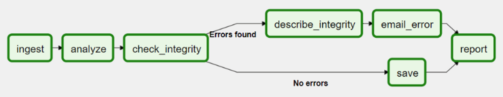
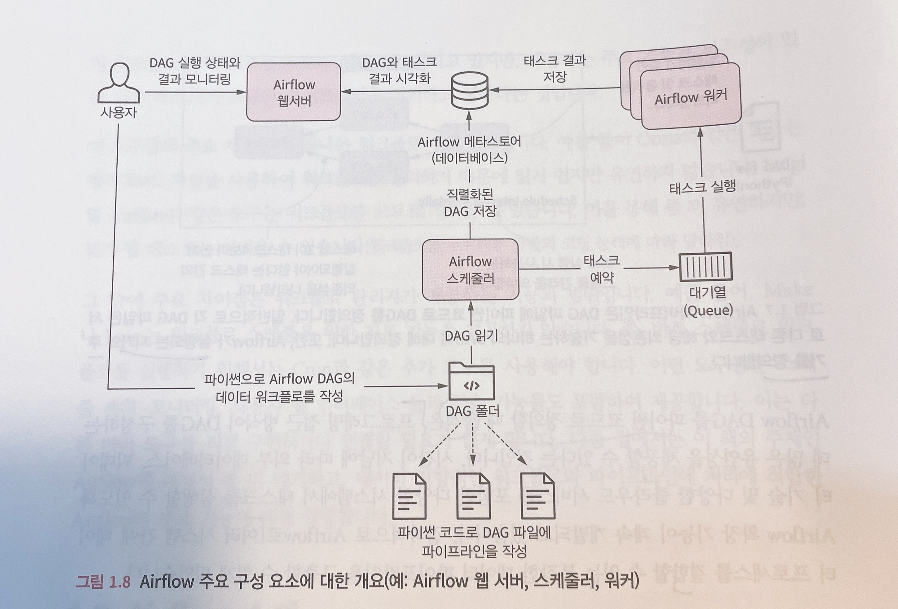

## 1. Airflow란?
- Apache Airflow는 초기 에어비엔비(Airfbnb) 엔지니어링 팀에서 개발한 워크플로우 오픈 소스 플랫폼
- Python 언어로 작성
  - **워크플로우** 란? : 의존성으로 연결된 작업(Task)들의 집합
  - (ex) ETL의 경우 Extractaction > Transformation > Loading 의 작업의 흐름 
  - 프로그래밍 방식으로 워크플로우를 작성, 예약 및 모니터링


## 2. Airflow 기본 구성 및 작동 원리
### (1) Airflow Key Concept
#### a. DAG (Directed Acyclic Graph)
- 단어 뜻 그대로 순환하지 않는 그래프, DAG(대그)라고 부름 
- 반복이나 순환을 허용하지 않음 
- 순차적으로 작업(task)이 이루어지며, 순환 실행을 방지하기 때문에 매우 중요함 
- → 논리적 오류는 교착상태(deadlock)로 이어짐


#### b. Operator
- Operator(Task)를 정의하는데 사용 
- Operator Type 
  - Action Operators 
    - 기능이나 명령을 실행하는 오퍼레이터 
    - 실제 연산을 수행, 데이터 추출 및 프로세싱
    - (참고) 내장 Operators는 BashOperator, PythonOperator, EmailOperator 
      - 이외의 오퍼레이터는 공식 documnet 참고 (링크)
  - Transfer Operater 
    - 하나의 시스템을 다른 시스템으로 옮김 (데이터를 Source에서 Destination으로 전송 등 )
    - 예를 들어, Presto에서 MySQL로 데이터를 전송하는데에 사용 
  - Sensor Operators 
    - 조건이 만족할 때까지 기다렸다가, 조건이 충족되면 다음 Task를 실행시킴

#### c. Task & Task Instance
- Task : 데이터 파이프라인에 존재하는 Operator를 의미 
  - Operator를 실행하면 Task가 됨 
- Task Instance 
  - 데이터 파이프 라인이 Trigger되어 실행될 때 생성된 Task를 Task Instance라고 함 
  - 태스크 실행 순서 정의 
    - 오른쪽 시프트 연산자(binary right shift operator), 즉 rshift(>>)를 사용하여 태스크의 의존성 정의함 
    ```angular2html
    ex))
    Task1 >> Task2 >> Task3
    [Task1, Task2] >> Task3
    ```

- Task VS Operator 
  - 사용자 관점에서는 두 용어를 같은 의미지만 Task 는 작업의 올바른 실행을 보장하기 위한 Manager임 
  - 사용자는 Operator를 사용해서 수행할 작업에 집중하며, Airflow는 태스크를 통해 작업을 올바르게 실행함 
- → 사용자는 각 환경별 작업이 잘 이루어지는지 확인하기 위해서 Operator내 코드를 구성하는데에 집중하고, 
- → Airflow는 각 Operator 내의 구성 요소들이 전부 잘 맞아야 작업이 이루어지는 형태의 차이로 보임

### (2) Airflow component
- 에어플로우는 웹서버, 스케줄러, metastore, Executor, Worker로 크게 5개의 기본 구성으로 이루어져 있음 
- 웹서버 : 웹 대시보드 UI로 스케줄러에서 분석한 Dag를 시각화하고 DAG 실행과 결과를 확인할 수 있는 인터페이스를 제공함 
- 스케줄러 : DAG를 분석하고 현재 시점에서 Dag의 스케줄이 지난 경우 airflow worker에 DAG의 태스크를 예약함 
- Worker : 예약된 태스크를 실제로 실행시키는 것 
- Metastore : 에어플로우에 있는 Dag, Task등의 메타데이터 관리 
- Executor : 태스크가 어떻게 실행되는지 정의



### (3) Airflow 기본 동작 원리
1. 유저가 새로운 Dag를 작성 → Dags Foolder 안에 py 파일 배치 
2. Web Server와 Scheuler가 파싱하여 읽어옴 
3. Scheduler가 Metastore를 통해 DagRun 오브젝터를 생성함 
   - DagRun은 사용자가 작성한 Dag의 인스턴스임 
   - `DagRun Status : Running`
4. 스케줄러는 Task Instance Object를 스케줄링함 
   - Dag Run object의 인스턴스임 
5. 트리거가 상황이 맞으면 Scheduler가 Task Instance를 Executor로 보냄 
6. Exeutor는 Task Instance를 실행시킴 
7. 완료 후 → MetaStore에 완료했다고 보고함 
   - 완료된 Task Instance는 Dag Run에 업데이트됨 
   - Scheduler는 Dag 실행이 완료되었는지 Metastore를 통해 확인 후에 Dag Run의 생태를 완료로 바꿈 
   - `DagRun Status : Completed`
8. Metastore가 Webserver에 업데이트해서 사용자도 확인


## 3. Airflow 장단점
### (1) 장점 
  - 파이썬 코드를 이용하여 파이프라인을 구현하므로 파이썬 언어에서 구현할 수 있는 대부분의 방법을 사용하여 복잡한 커스텀 파이프라인을 만들 수 있음 
  - 확장성 -> 파이썬 기반으로 쉽게 확장 가능하고 다양한 시스템과 통합이 가능 
  - 다양한 유형의 DB, Cloud Service 등 통합 가능 
  - 데이터 인프라 관리, 데이터 웨어하우스 구축, 머신러닝/분석/실험에 데이터 환경 구성에 유용함 
  - 에어플로우의 스케줄링 기능으로 DAG에 정의된 특정 시점에 트리거할 수 있을 뿐만 아니라 최종 시점과 예상되는 다음 스케줄 주기를 상세하게 알려줌 
  - 백필 기능을 사용하면 과거 데이터를 손쉽게 재처리할 수 있기에 코드를 변경후 재생성이 필요한 데이터 재처리가 가능함
### (2) 단점 
  - 파이썬 경험이 없는 경우 DAG 구성의 어려움이 있을 수 있음 
  - 초기 설치는 간단해 보일지라도 작은 환경 변화에도 작동에 오류가 나는 경우가 있어 롤백하는 경우가 꽤 있음
### (3) 주의 사항 
  - Data Streaming Solution 적용하기엔 적합하지 않음 
  - 초단위의(그 이하) 데이터 처리가 필요한 경우에 사용하기에는 부적절함 
  - 에어플로우는 반복적이거나 배치 태스크를 실행하는 기능에 초점이 맞춰져 있음 
  - Data Processing Framework (like Flink, Spark, Hadoop, etc ..)로 사용하는 것은 부적절함 
  - 데이터 프로세싱 작업에 최적화 되어있지않아서 매우 느림 
  - 경우에 따라 메모리 부족으로 작업이 진행되지 않을 수도 있음 
    - → SparkSubmitOperator와 같은 Operator를 이용하여, 데이터 프로세싱은 Spark와 같은 외부 Framework로 처리 
  - 파이프라인 규모가 커지면 파이썬 코드가 굉장히 복잡해질 수 있음 → 초기 사용 시점에 엄격한 관리를 해야함