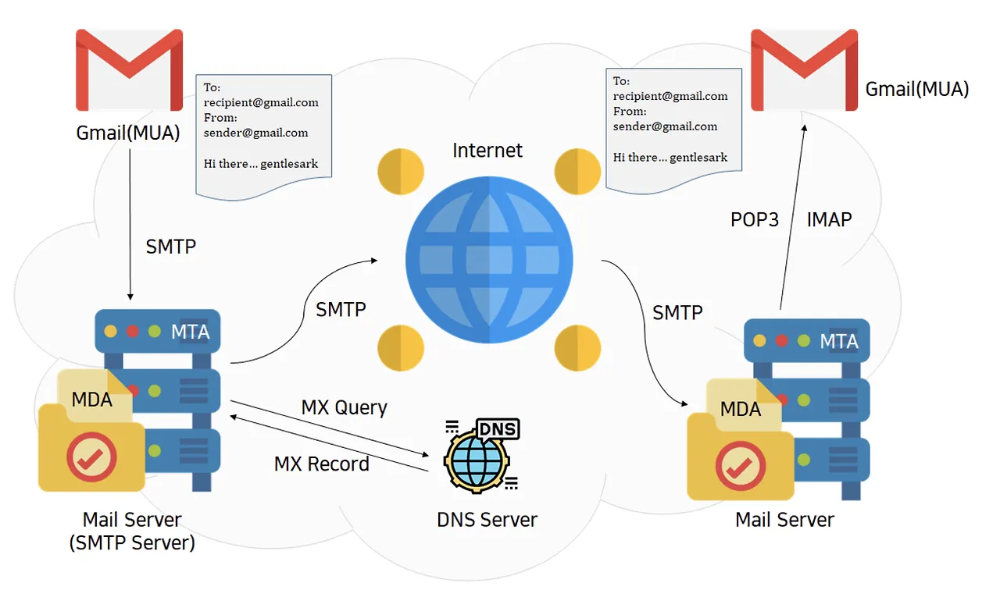

# 이메일 발송 원리

### 기본 원리
- `발신자 메일 클라이언트 -> 발신자 메일 서버 -> 수신자 메일 서버 -> 수신자 메일 클라이언트`
  - 메일 클라이언트는 사용자가 이메일을 보내거나 받을 때 사용하는 프로그램 정도로 이해
  - 메일 서버는 이메일 발송을 담당하는 원격 서버라고 생각
  - ex) 만약 구글 이메일 계정에서 네이버 이메일 계정으로 이메일을 보낸다면, 발신자 메일 서버는 구글 메일 서버가 되고 수신자 메일 서버는 네이버 메일 서버가 될 것

** MUA(Mail User Agent) ** 
- 메일 클라이언트    
- Outlook 등의 프로그램이나 Gmail 등의 웹 메일 형태로 존재한다.

1. 발신자 메일 클라이언트 -> 발신자 메일 서버
- 발신자가 이메일을 작성하고 보내기를 수행하면 MUA는 발신자 메일 서버에 SMTP 프로토콜을 이용하여 MIME 포맷으로 이메일을 보낸다.
- EX) 만약 Gmail을 이용하여 이메일을 보낸다면, MUA는 Gmail이고 발신자 메일 서버는 구글 메일 서버일 것이다. 
  - (이때 MUA는 발신자 메일 서버의 정보를 이미 알고 있기 때문에 발신자 메일 서버의 IP를 알아내기 위한 별도의 과정이 필요 없을 것이다.)

2. 발신자 메일 서버 -> 수신자 메일 서버
- 발신자 메일 서버는 MUA 로부터 받은 이메일을 메일 서버 내에 존재하는 `메일 큐`라는 공간에 저장한다.
- 메일 큐는 발신자 메일 서버가 수신자 메일 서버에게 보내야 하는 이메일들을 저장하고 있는 공간이다.
- 때가 되면 발신자 메일 서버가 메일 큐에서 이메일을 하나씩 꺼내서 SMTP 프로토콜을 이용하여 수신자 메일 서버에 보낼 수 있도록 스케쥴링하는데 활용한다.

** 메일서버 **
  - 메일 클라이언트로부터 메일을 받을 수도 있고 다른 메일 서버에게 메일을 보낼 수도 있기 때문에 내부적으로는 서버 프로세스오와 클라이언트 프로세스가 모두 존재한다. 
  - 그리고 메일을 받을 때와 보낼 때 모두 SMTP 프로토콜을 이용하기 때문에 메일 서버를 SMTP 서버라고도 부른다.
  - 메일 서버 == SMTP 서버

- 발신자 메일 서버는 수신자 메일 서버에게 이메일을 보내기 위해 수신자 메일 서버의 IP 주소를 알아내야 한다.
- 이를 위해 메일 서버 내에 존재하는 MTA(Mail Transfer Agent)는 수신자 이메일의 도메인에 대해 `Mx 레코드`를 찾도록 DNS 쿼리를 수행한다. 
- 만약 구글 이메일 계정에서 네이버 이메일 계정으로 이메일을 보낸디면 naver.com 도메인에 대해 MX 레코드를 찾도록 DNS 쿼리를 수행할 것이다.
- 이때 MX 레코드의 값은 메일 서버의 도메인으로 설정되어 있을 것이므로 찾아낸 MX 레코드의 값에 대해 다시 DNS  쿼리를 수행하면 수신자 메일 서버의 IP 주소를 알아낼 수 있게 된다.
- 따라서 어떤 도메인을 메일 시스템으로 활용하고 싶다면 적절한 메일 서버를 갖출 뿐 아니라 그 도메인에 해당하는 DNS 서버에서도 적절한 MX 레코드를 설정해줘야 한다.

** MX 레코드 **
- 메일이 수신될 위치를 결정하는 레코드
- 네이버웍스의 MX 레코드가 설정되어 있어야 수신 메일이 네이버웍스 메일함으로 들어올 수 있다.

3. 수신자 메일 서버 -> 수신자 메일 클라이언트
- 수신자 메일 서버의 MTA는 MDA(Mail Delivery Agent)를 이용하여 발신자 메일 서버로부터 받은 이메일을 메일 서버 내에 존재하는 메일 박스라는 공간에 저장한다.
- 메일 박스는 발신자 메일 서버로부터 받은 메일들을 사용자별로 나눠 저장하는 공간이다.
- 그러면 수신자의 MUA는 수신자 메일 서버의 메일 박스로부터 POP3 혹은 IMAP 프로토콜을 이용하여 이메일을 불러오고, 이를 통해 수신자가 자신이 받은 이메일들을 확인할 수 있게 된다.
