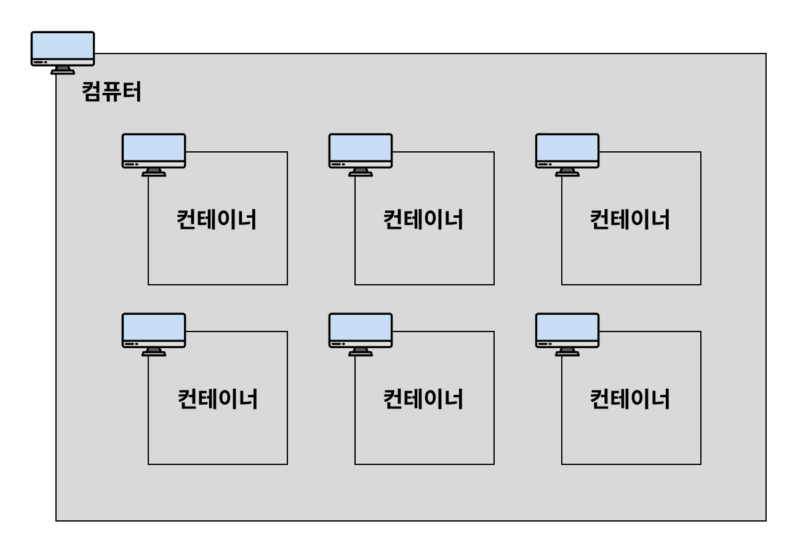

### Docker 개요

#### 도커를 배우는 이유
- 이식성
  - 상황1 
    - A의 컴퓨터에서 MySQL을 깔고 정상 작동하는 것을 확인하고 B의 컴퓨터에 MySQL을 깔았더니 에러가 발생
    - B의 컴퓨터가 에러가 발생하는 이유는 A와 다른 버전을 설치했거나, 운영체제가 다르거나, 충돌이 일어났거나 등..
    - 이러한 상황을 해결해주는 도구가 **Docker**다. -> 명령어 한 줄로 어떤 컴퓨터든 에러없이 설치하고 실행 가능

#### 도커
- 컨테이너를 사용하여 각각의 프로그램을 분리된 환경에서 실행 및 관리할 수 있는 Tool

#### 컨테이너
- 위에서 말한 분리된 환경을 컨테이너라고 부른다.

- 컨테이너와 컨테이너를 포함하고 있는 컴퓨터를 구분하기 위해 컨테이너를 포함하고 있는 컴퓨터를 호스트 컴퓨터라고 한다.

#### 이미지
- 컨테이너를 정의하는 읽기 전용 템플릿
- 프로그램을 실행하는데 필요한 설치 과정, 설정, 버전 정보 등 프로그램을 실행하는데 필요한 모든 것을 포함

### Docker 명령어
1. 이미지 다운로드
   - 이미지를 다운로드 할 때 Dockerhub 라는 곳에서 이미지를 다운받는다.
   - Dockerhub는 Github 처럼 이미지를 저장 및 다운받을 수 있는 저장소 역할
- 최신 버전(latest) 이미지 다운로드
    ```angular2html
        # docker pull 이미지명
        $ docker pull nginx # docker pull nginx:latest와 동일하게 작동
    ```
- 특정 버전 이미지 다운로드
    ```angular2html
        # docker pull 이미지명:태그명
        $ docker pull nginx:stable-perl
    ```
2. 이미지(Image) 조회
- 다운받은 모든 이미지 조회
  - ls : list의 약자
      ```angular2html
          $ docker image ls
      ```
3. 이미지(Image) 삭제
- 특정 이미지 삭제
  - rm : remove의 약자 
  - 이미지 ID를 입력할 때 전체 ID를 다 입력하지 않고 ID의 일부만 입력해도 된다. 
  - 컨테이너에서 사용하고 있지 않은 이미지만 삭제 가능
      ```angular2html
          $ docker image rm [이미지 ID 또는 이미지명]
      ```
- 중지된 컨테이너에서 사용하고 있는 이미지 강제 삭제
  - 실행 중인 컨테이너에서 사용하고 있는 이미지는 강제로 삭제할 수 없다. → 따라서 반드시 컨테이너를 중지 시킨 후에 이미지 삭제
      ```angular2html
          $ docker image rm -f [이미지 ID 또는 이미지명]
      ```
- 전체 이미지 삭제
  - docker images -q : 시스템에 있는 모든 이미지의 ID 반환
  - 여기서 -q 옵션은 quite를 의미하며, 상세 정보 대신에 각 이미지의 고유한 ID만 표시하도록 지시
      ```angular2html
          # 컨테이너에서 사용하고 있지 않은 이미지만 전체 삭제
          $ docker image rm $(docker images -q)
    
          # 컨테이너에서 사용하고 있는 이미지를 포함해서 전체 이미지 삭제
          $ docker image rm -f $(docker images -q)
      ```
4.  컨테이너(Container) 생성/실행
- 컨테이너 생성
   - 이미지를 바탕으로 컨테이너 생성
   - 다음 명령어는 컨테이너를 생성만 하고 실행시키지는 않는다.
   - 로컬 환경에 다운받은 이미지가 없다면 Dockerhub으로부터 이미지를 다운(docker pull)받아서 컨테이너를 생성합니다.
     ```angular2html
         # docker create 이미지명[:태그명]
         $ docker create nginx
    
         $ docker ps -a # 모든 컨테이너 조회
     ```
- 컨테이너 실행
    ```angular2html
          # docker start 컨테이너명[또는 컨테이너 ID]
          $ docker start 컨테이너명[또는 컨테이너 ID]
    
          $ docker ps # 실행중인 컨테이너 조회
    
          # Nginx 컨테이너 중단 후 삭제하기
          $ docker ps # 실행 중인 컨테이너 조회
          $ docker stop {nginx를 실행시킨 Contnainer ID} # 컨테이너 중단
          $ docker rm {nginx를 실행시킨 Contnainer ID} # 컨테이너 삭제
          $ docker image rm nginx # Nginx 이미지 삭제
    ```

- 컨테이너 생성 + 실행
  - 다음 명령어는 이미지를 바탕으로 컨테이너를 생성한 뒤, 컨테이너 실행
  - -> 처음에 이미지를 바탕으로 컨테이너를 실행시키고 싶을 때, 이 명령어를 자주 사용
  - 로컬 환경에 다운받은 이미지가 없다면 Dockerhub으로부터 이미지를 다운(docker pull)받아서 실행시킵니다. 
  - Dockerhub으로부터 새롭게 갱신된 이미지를 다운 받고 싶다면 docker pull 명령어를 활용해야 합니다.
    ```angular2html
    # docker run 이미지명[:태그명]
    $ docker run nginx # 포그라운드에서 실행 (추가적인 명령어 조작을 할 수가 없음)
    
    # Ctrl + C로 종료할 수 있음
    ```

- 컨테이너를 백그라운드에서 실행시키기
    ```angular2html
    # docker run -d 이미지명[:태그명]
    $ docker run -d nginx
    
    # Nginx 컨테이너 중단 후 삭제하기
    $ docker ps # 실행 중인 컨테이너 조회
    $ docker stop {nginx를 실행시킨 Contnainer ID} # 컨테이너 중단
    $ docker rm {nginx를 실행시킨 Contnainer ID} # 컨테이너 삭제
    $ docker image rm nginx # Nginx 이미지 삭제
    ```
- **참고**
- 포그라운드(foreground) vs 백그라운드(background)
  - 포그라운드
    - 내가 실행시킨 프로그램의 내용이 화면에서 실행되고 출력되는 상태
    - 그러다보니 포그라운드 상태에서는 다른 프로그램을 조작할 수가 없다. 
  - 백그라운드
    - 내가 실행시킨 프로그램이 컴퓨터 내부적으로 실행되는 상태
    - 그래서 프로그램이 어떻게 실행되고 있는 지에 대한 정보를 화면에서 확인할 수 없다. 
    - 이런 특성 때문에 다른 명령어를 추가로 입력할 수도 있고, 새로운 프로그램을 조작할 수도 있다.

- 컨테이너에 이름 붙여서 생성 및 실행하기
    ```angular2html
    # docker run -d --name [컨테이너 이름] 이미지명[:태그명]
    $ docker run -d --name my-web-server nginx
    
    # Nginx 컨테이너 중단 후 삭제하기
    $ docker ps # 실행 중인 컨테이너 조회
    $ docker stop {nginx를 실행시킨 Contnainer ID} # 컨테이너 중단
    $ docker rm {nginx를 실행시킨 Contnainer ID} # 컨테이너 삭제
    $ docker image rm nginx # Nginx 이미지 삭제
    ```
  

5. 컨테이너(Container) 조회/중지/삭제
- 컨테이너 조회
  - ps : process status의 약자
  - a: all의 약자
        ```angular2html
        $ docker ps # 실행 중인 컨테이너들만 조회
        $ docker ps -a # 모든 컨테이너 조회(작동 중인 컨테이너 + 작동을 멈춘 컨테이너)
        ```
- 컨테이너 중지
  - 집에 있는 컴퓨터로 비유하자면 stop은 시스템 종료 버튼을 통해 정상적으로 컴퓨터를 종료하는 걸 의미하고, 
  - kill은 본체 버튼을 눌러 무식하게 종료하는 걸 의미
      ```angular2html
      $ docker stop 컨테이너명[또는 컨테이너 ID]
      $ docker kill 컨테이너명[또는 컨테이너 ID]
      ```
- 컨테이너 삭제
```angular2html
$ docker rm 컨테이너명[또는 컨테이너 ID] # 중지되어 있는 특정 컨테이너 삭제
$ docker rm -f 컨테이너명[또는 컨테이너 ID] # 실행되고 있는 특정 컨테이너 삭제
$ docker rm $(docker ps -qa) # 중지되어 있는 모든 컨테이너 삭제
$ docker rm **-f** $(docker ps -qa) # 실행되고 있는 모든 컨테이너 삭제
```

6. 컨테이너(Container) 로그 조회
- 컨테이너를 실행시키고나서 실행시킨 컨테이너가 잘 실행되고 있는 지, 에러가 발생한 건 아닌 지 로그를 확인할 수 있어야 한다.
- 특정 컨테이너의 모든 로그 조회
    ```angular2html
    # docker logs [컨테이너 ID 또는 컨테이너명]
    
    $ docker run -d nginx
    $ docker logs [nginx가 실행되고 있는 컨테이너 ID]
    ```
- 최근 로그 10줄만 조회
    ```angular2html
    # dokcer logs --tail [로그 끝부터 표시할 줄 수] [컨테이너 ID 또는 컨테이너명]
    $ dokcer logs --tail 10 [컨테이너 ID 또는 컨테이너명]
    ```
- 기존 로그 조회 + 생성되는 로그를 실시간으로 보고 싶은 경우
   - f : follow의 약어
    ```angular2html
    # docker logs -f [컨테이너 ID 또는 컨테이너명]
    
    # Nginx의 컨테이너에 실시간으로 쌓이는 로그 확인하기
    $ docker run -d -p 80:80 nginx
    $ docker logs -f
    ```
- 기존 로그는 조회하지 않기 + 생성되는 로그를 실시간으로 보고 싶은 경우
    ```angular2html
    $ docker logs **--tail 0 -f** [컨테이너 ID 또는 컨테이너명]
    ```

7. 실행중인 컨테이너 내부에 접속하기 (exec -it)
- 실행 중인 컨테이너 내부에 접속하기
    - 컨테이너 내부에서 나오려면 Ctrl + D 또는 exit
    ```angular2html
    # docker exec -it 컨테이너명[또는 컨테이너 ID] bash
    
    $ docker run -d nginx
    $ docker exec -it [Nginx가 실행되고 있는 컨테이너 ID] bash
    $ ls # 컨테이너 내부 파일 조회
    $ cd /etc/nginx
    $ cat nginx.conf
    ```
- bash : 쉘(Shell)의 일종
- -it : -it옵션을 사용해야 명령어를 입력하고 결과를 확인할 수 있다. 
- -it옵션을 적지 않으면 명령어를 1번만 실행시키고 종료되어 버린다. 
- 즉, -it 옵션을 적어야 계속해서 명령어를 입력할 수 있다.


#### Docker Desktop
- 도커를 윈도우나 맥에서도 쉽게 쓸 수 있게 해주는 앱이자 도커 데몬을 실행해주는 도구
- 역할
  - 윈도우에는 리눅스 커널이 없어서 도커가 바로 실행 안됨

### Docker 구조
1. `which docker`
   - 도커가 실제로 어디에 있는지 출력하면 아래와 같은 위치에 도커가 존재하고 있다.
   - `/usr/bin/docker`
   - 즉, docker 명령어는 위 파일을 통해 사용되고 있다는 의미
   - 그렇다면 이번에는 실행중인 도커 프로세스를 아래 명령어로 확인하면
   - `ps aux | grep docker`
   ```
   root       307  0.0  0.5 2803304 84180 ?       Ssl  10:55   0:04 /usr/bin/dockerd -H fd:// --containerd=/run/containerd/containerd.sock
   root       500  0.0  0.1 1247540 21436 pts/4   Ssl+ 12:56   0:00 /mnt/wsl/docker-desktop/docker-desktop-user-distro proxy --distro-name Ubuntu --docker-desktop-root /mnt/wsl/docker-desktop C:\Program Files\Docker\Docker\resources
   ks       55980  0.0  0.0   4092  2020 pts/9    S+   16:30   0:00 grep --color=auto --exclude-dir=.bzr --exclude-dir=CVS --exclude-dir=.git --exclude-dir=.hg --exclude-dir=.svn --exclude-dir=.idea --exclude-dir=.tox --exclude-dir=.venv --exclude-dir=venv docker
    ```
   - 위에서 도커가 위치된 `/usr/bin/docker`가 실행되고 있어야 하는데 `/usr/bin/dockerd` 가 실행 중이다.

### Docker daemon
   - api 요청을 수신하고 이미지, 컨테이너, 네트워크 및 볼륨과 같은 docker 객체를 관리한다.

### Docker client
   - Docker client 는 많은 Docker 사용자가 Docker와 상호작용하는 기본 방법이다.
   - `docker run` 같은 명령어를 사용하면 클라이언트가 이러한 명령을 API로서 ***dockered*** 로 보낸다.
   - 이때 Docker client는 /var/run/docker.sock에 있는 Unix Socket을 통해 Docker daemon의 API를 호출한다.
   - Docker client가 사용하는 Unix Socket은 같은 호스트 내에 있는 Docker daemon에게 명령을 전달할 때 사용된다.
   - tcp로 원격에 있는 Docker daemon을 제어하는 방법도 있다.

### Docker registries
   - Docker registries는 Docker image 를 저장한다.
   - Docker Hub는 누구나 사용할 수 잇는 공용 레지스트리고 Docker는 기본적으로 Docker Hub에서 Docker image를 찾는다.
   - Docker는 클라이언트-서버 구조를 가진다. Docker client는 도커 컨테이너를 빌드, 실행 및 배포에 대한 무거운 작업을 수행하는 Docker daemon과 통신을 한다.
   - Docker client와 Docker Daemon은 동일한 시스템에서 실행되거나 Docker client를 원격 Docker daemon에 연결할 수 있다.
   - 이런 Docker Client 와 Docker daemon은 Unix Socket or Network interface를 통해 REST API를 사용하여 통신한다.