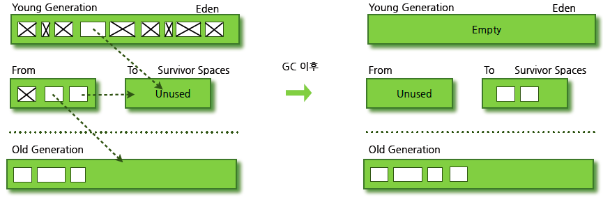
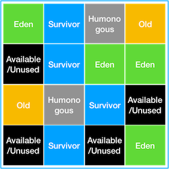

<details>
  <summary><b>Java 의 장단점에 대해 설명해주세요.</b></summary>

### 답변
- 장점
  - 운영체제에 독립적이다. 
    - JVM에서 동작하기 때문에, 특정 운영체제에 종속되지 않는다.
  - 객체지향 언어이다. 
    - 객체지향적으로 프로그래밍 하기 위해 여러 언어적 지원을 하고있다. (캡슐화, 상속, 추상화, 다형성)
    - 객체지향 패러다임의 특성상 비교적 이해하고 배우기 쉽다.
- 단점
  - 비교적 속도가 느리다. 
    - 자바는 한 번의 컴파일링으로 실행 가능한 기계어가 만들어지지 않고 JVM에 의해 기계어로 번역되고 실행하는 과정을 거치기 때문에 C나 C++의 컴파일 단계에서 만들어지는 완전한 기계어보다는 속도가 느리다. 
    - 그러나 하드웨어의 성능 향상과 바이트 코드를 기계어로 변환해주는 JIT 컴파일러 같은 기술 적용으로 JVM의 기능이 향상되어 속도의 격차가 많이 줄어들었다.

</details>

---

<details>
  <summary><b>java와 c/c++의 차이점</b></summary>

### 답변
- java와 c/c++의 가장 큰 차이점은 `실행 환경`이다. 
- java에서의 개발
  - 컴파일 or 컴파일 + jar압축 
  - 자바는 링크 과정이 없이 컴파일러가 바로 바이트 코드를 생성 
  - 바이트 코드는 자바 가상 기계에서만 실행 가능
- c/c++에서의 개발
  - 컴파일러가 중간 단계인 오브젝트 코드를 생성한 후 링커가 필요한 라이브러리를 링크하여 최종 실행 가능한 실행 파일을 생성
  - 컴파일 + 링커
  - Linking(링킹)
    - Linking(링킹)은 여러 개의 코드와 데이터를 모아서 연결하여 메모리에 로드될 수 있고 실행될 수 있는 한 개의 파일로 만드는 작업

</details>

---
<details>
  <summary><b>객체지향이란 무엇인지 설명해주세요.</b></summary>

### 답변
- 객체
  - 현실 세계의 실체 및 개념을 반영하는 상태와 행위를 정의한 데이터의 집합
- 객체지향 프로그래밍
  - 실세상의 물체를 객체로 표현하고, 이들 사이의 관계, 상호 작용을 프로그램으로 나타낸다.
  - 객체를 추출하고 객체들의 관계를 결정하고 이들의 상호 작용에 필요한 함수(메서드)와 변수(필드)를 설계 및 구현하다.
  - 각자의 역할을 지닌 객체들끼리 서로 메시지를 주고받으며 동작할 수 있도록 프로그래밍하는 것
  - 프로그래밍에서 필요한 데이터를 추상화시켜 상태와 행위를 가진 객체를 만들고 그 객체들 간의 유기적인 상호작용을 통해 로직을 구성하는 프로그래밍 방법

- 절차지향 프로그래밍이란? <-> 객체지향 프로그래밍
  - 실행하고자 하는 절차를 정하고 이 절차대로 프로그래밍하는 방법 
  - 목적을 달성하기 위한 일의 흐름에 중점을 둔다.

</details>

<details>
  <summary><b>객체지향 프로그래밍의 장단점에 대해 설명해주세요.</b></summary>

### 답변
- 객체지향 프로그래밍
  - 프로그래밍에서 필요한 데이터를 추상화시켜 상태와 행위를 가진 객체를 만들고 그 객체들 간의 유기적인 상호작용을 통해 로직을 구성하는 프로그래밍 방법
- 장점
  - 코드 재사용 용이 
  - 유지보수 용이 
  - 대형 프로젝트에 적합
- 단점
  - 처리 속도 느림 
  - 설계가 어려움

</details>

<details>
  <summary><b>객체지향 프로그래밍의 특징에 대해 설명해주세요.</b></summary>

### 답변
- 캡상추다
- 캡슐화 -- 데이터 보호
  - 클래스 안에 서로 연관있는 속성과 기능들을 하나의 캡슐로 만들어 데이터를 외부로부터 보호하는 것 
  - 목적 
    - 데이터 보호: 외부로부터 클래스에 정의된 속성과 기능들을 보호 
    - 데이터 은닉: 내부의 동작을 감추고 외부에는 필요한 부분만 노출 (각 객체 고유의 독립성과 책임 영역을 안전하게 지킬 수 있다.)
  - 접근제어자와 getter/setter 를 통해 구현
  ```java
  public class Person{
  private int age;
  private String name;
  
      public int getAge() {
          return age;
      }
      public void setAge(int age) {
          this.age= age;
      }
  
      public String getName() {
          return name;
      }
      public void setName(String name) {
          this.name = name;
      }
  }
  ```
  - Person이라는 클래스에 이름, 나이와 같은 속성을 묶어 캡슐화를 하였다. 
  - 이 클래스의 이름, 나이는 접근제한자가 private이기 때문에 직접 바꿀 수 없으며 get, set 함수로만 접근할 수 있다.
- 상속 -- 코드 재사용
  - 기존의 클래스를 재활용하여 새로운 클래스를 작성하는 자바의 문법요소 --> 자식클래스가 부모클래스의 특징과 기능을 물려받는 것
  - 코드의 재사용을 통해 반복적인 코드를 최소화하고 공유하는 속성과 기능에 간편하게 접근할 수 있다. 
  - 상속과 구현 
    - 상속: 상위 클래스의 속성과 기능들을 하위 클래스에서 그대로 받아 사용하거나 오버라이딩을 통해 선택적으로 재정의해서 사용 
    - 구현: 반드시 인터페이스에 정의된 추상 메서드의 내용이 하위 클래스에서 정의
- 추상화 -- 핵심적인 코드만 보여주기
  - 객체의 공통적인 속성과 기능을 추출하여 정의하는 것 
  - 구체적인 사물들의 공통적인 특징을 파악해서 이를 하나의 개념(집합)으로 다루는 것 --> 불필요한 부분을 숨긴다
  - 추상클래스와 인테페이스로 구현 (인터페이스와 구현을 분리한다.)
  ```java
  // interface.java
  public interface DiscountPolicy {
	 int discount(Member member, int price);
  }
  
  // class.java
  class FixDiscountPolicy implements DiscountPolicy{
  
          private int discountFixAmount = 1000; //1000원 할인
          
          // 1000원 할인
          @Override
          public int discount(Member member, int price){...}
  }
  ```
  - FixDiscountPolicy.class 가 DiscountPolicy 인터페이스를 상속 받는다.
  - 이렇게 할인정책이라는 것의 공통 속성을 빼내어 DiscountPolicy라는 인터페이스를 만들어냈다. 이게 추상화!
  ```java
  // main.java
  DiscountPolicy discountPolicy = new RateDiscountPolicy();
  discountPolicy.discount(member, 10000);
  ```
  - 위 코드에서 실행되는 discount 메서드는 자식 클래스인 RateDiscountPolicy 의 메서드이다.
  - 하지만 실행클래스에서는 RateDiscountPolicy 객체를 DiscountPolicy 타입으로 바꿔 사용하고 있기 때문에 RateDiscountPolicy의 구현부를 알지 못한다.
  - 따라서 구현객체에 의존하지 않고 추상객체인 인터페이스에 의존함으로써 구현 코드를 숨긴다.
  - 그리고 이 DiscountPolicy 객체를 사용하는 입장에서는 인터페이스 타입 객체를 쓰고 있기 때문에 메서드가 어떻게 구현된 것인지는 알 수 없다. (이게 바로 추상화 !)
- 다형성 -- 객체 변경 용이
  - 객체의 속성이나 기능이 상황에 따라 여러 가지 형태를 가질 수 있는 성질 --> 어떤 변수, 메소드가 상황에 따라 다른 결과를 내는 것
  - 서로 다른 클래스의 객체가 같은 메시지를 받았을 때 각자의 방식으로 동작하는 능력
  - 위 코드로 내가 작성했는데 갑자기 기획자가 와서 "우리는 1000원 할인이 아니라 10% 할인으로 바꿀 겁니다~^^" 라고 했다면,
  - 우리는 추상화를 설정했기 때문에
  ```java
  // class.java
  public class RateDiscountPolicy implements DiscountPolicy {
     
     private int discountPercent = 10; //10% 할인
  
     //10% 할인
     @Override
     public int discount(Member member, int price) {...}
    }
  }
  ```
  - 이런 식으로 RateDiscountPolicy.class 를 추가하면 될 것이다. 그러면 다형성을 이용해 객체를 사용해보자.
  ```java
  DiscountPolicy discountPolicy = new FixDiscountPolicy(); // 기존 1000원 할인정책
  DiscountPolicy discountPolicy = new RateDiscountPolicy(); // 바꾼 10% 할인정책
  ```
  - 이렇게 상위(인터페이스) 타입으로 바꿔서 사용한다면 원래 1000원 할인을 할 때에서 10% 할인으로 바꿀 때 코드 수정을 최소화할 수 있다.
  - 왜나하면 똑같은 타입의 객체지만 다르게 동작하기 때문이다. (이게 바로 다형성 !)
  - 다형성을 가능하게 하는 것들
    - 오버라이딩(overriding) : 부모클래스 메서드를 자식클래스에서 재정의하는 것
    ```java
    class Parent {
      void display() {
          System.out.println("부모 클래스의 display() 메소드입니다.");
      }
    }
  
    class Child extends Parent {
      void display() {
          System.out.println("자식 클래스의 display() 메소드입니다.");
      }
    }
  
    // main.java
    Parent pa = new Parent();
    pa.display(); //부모 클래스의 display() 메소드입니다.

    Child ch = new Child();
    ch.display(); //자식 클래스의 display() 메소드입니다.
    ```

    - 오버로딩(overloading) : 한 클래스에서 메소드 이름은 같지만 파라미터 개수나 자료형을 다르게 하여 서로 다르게 동작하게 하는 것
    ```java
      void display(int num1){System.out.println(num1)}              
      void display(int num1, int num2){System.out.println(num1+num2)}
      void display(int num1, double num2){System.out.println(num1+num2)}

      // main.java
      display(10);       // display(int num1) 메소드 호출 -> 10
      display(10, 20);   // display(int num1, int num2) 메소드 호출 -> 200
      display(10, 3.14); // display(int num1, double num2) 메소드 호출 -> 13.14
    ```

</details>

<details>
  <summary><b>객체지향 프로그래밍의 5대 원칙에 대해 설명해주세요.</b></summary>

### 답변
- "SOLID" 원칙

- S: 단일 책임 원칙(SRP, Single Responsibility Principle)
  - 객체는 단 하나의 책임만 가져야 한다. 
- O: 개방-폐쇄 원칙(OCP, Open Closed Principle)
  - 기존의 코드를 변경하지 않으면서 기능을 추가할 수 있도록 설계가 되어야 한다. 
- L: 리스코프 치환 원칙(LSP, Liskov Substitution Principle)
  - 일반화 관계에 대한 이야기며, 자식 클래스는 최소한 자신의 부모 클래스에서 가능한 행위는 수행할 수 있어야 한다. 
- I: 인터페이스 분리 원칙(ISP, Interface Segregation Principle)
  - 인터페이스를 클라이언트에 특화되도록 분리시키라는 설계 원칙이다. 
- D: 의존 역전 원칙(DIP, Dependency Inversion Principle)
  - 의존 관계를 맺을 때 변화하기 쉬운 것 또는 자주 변화하는 것보다는 변화하기 어려운 것, 거의 변화가 없는 것에 의존하라는 것이다.

</details>

---
<details>
  <summary><b>Java 는 Call by Value 인가요 Call by Reference 인가요?</b></summary>

### 답변
- 자바는 Call by Value 를 따릅니다. 
- 기본 자료형의 경우 `해당 값이 복사`되어 전달되고, 
- 참조 자료형의 경우 `힙 메모리의 참조값이 복사`되어 전달됩니다.

- 자바에서 파라미터는 항상 `값`으로 전달됩니다. (파라미터의 복사본이 메서드에 전달)
- `기본 자료형`의 경우 `값의 복사본`이 전달됩니다.
- `참조 자료형`의 경우 힙 메모리의 `주소값이 복사`되어 전달됩니다.
  - 아래 예시의 경우 User 의 메모리가 복사되어 전달된다. 
  - b 의 경우 새로운 주소를 할당하는데 메서드가 종료되면 원본 b 에는 반영되지 않는다.
  ```java
  class User {
      public int age;
  
      public User(int age) {
          this.age = age;
      }
  }
  
  public class ReferenceTypeTest {
  
      void test() {
          User a = new User(10);
          User b = new User(20);
  			  
          System.out.println(a); // age: 10
          System.out.println(b); // age: 20
          modify(a, b);
  
          System.out.println(a); // age: 11 
          System.out.println(b); // age: 20
      }
  
      private void modify(User a, User b) {
          a.age++;
  
          b = new User(30);
          b.age++;
      }
  }
  ```
  
</details>

---
<details>
  <summary><b>Java 의 데이터 타입에 대해 설명해주세요.</b></summary>

### 답변
- 자바의 데이터 타입은 기본 데이터 타입과 참조 타입으로 나뉩니다. 
- 기본 데이터 타입으로는 byte, short, int, long, float, double, boolean, char 가 있으며 Stack 영역에 저장됩니다. 
- 참조 타입은 기본형은 제외한 모든 타입이며 Heap 영역에 저장됩니다.

- `기본 데이터 타입(Primitive Data Type)`
  - 정수형 : byte, short, int, long
  - 실수형 : float, double
  - 논리형 : boolean(ture/false)
  - 문자형 : char
  - 기본 타입의 크기가 작고 고정적이기 때문에 메모리의 Stack 영역에 저장된다.

- `참조 타입(Reference Data Type)`
  - 참조 타입 종류: class, array, interface, Enumeration
  - 기본형을 제외하고는 모두 참조형
  - new 키워드를 이용하여 객체를 생성하여 데이터가 생성된 주소를 참조하는 타입이다.
  - String, StringBuffer, List, 개인이 만든 클래스 등
  - String과 배열은 참조 타입과 달리 new 없이 생성이 가능하지만 기본 타입이 아닌 참조 타입이다.
  - 참조 타입의 데이터의 크기가 가변적, 동적이기 때문에 동적으로 관리되는 Heap 영역에 저장된다.
  - 더 이상 참조하는 변수가 없을 때 가비지 컬렉션에 의해 파괴된다.
  - 참조 타입은 값이 저장된 곳의 주소를 저장하는 공간으로 객체의 주소를 저장한다. (Call-By-Value)
</details>

<details>
  <summary><b>Wrapper 클래스와 Boxing, Unboxing 에 대해서 설명해주세요.</b></summary>

### 답변
- 기본 타입의 데이터를 Wrapper 클래스의 값으로 변환하면 Boxing, 반대의 경우를 Unboxing이라고 합니다. 
- 프로그램에 따라 기본 타입의 데이터를 객체로 취급해야 하는 경우가 있다. 
- 예를 들어, 메소드의 인수로 객체 타입만이 요구되면 기본 타입의 데이터를 그대로 사용할 수는 없다. 
- 이때 기본 타입의 데이터를 먼저 객체로 변환한 후 작업을 수행해야 한다.

- Wrapper Class
  - 프로그램에 따라 기본 데이터 타입을 객체로 취급해야 하는 경우, 기본 타입들의 데이터를 객체로 포장한 클래스
  - java.lang 패키지에 존재

| 기본 타입     | 래퍼 클래스      |
|-----------|-------------|
| `byte`    | `Byte`      |
| `short`   | `Short`     |
| `int`     | `Integer`   |
| `long`    | `Long`      |
| `float`   | `Float`     |
| `double`  | `Double`    |
| `char`    | `Character` |
| `boolean` | `Boolean`   |

### 박싱(Boxing), 언박싱(Unboxing)
- Boxing
  - 기본 타입의 데이터를 Wapper 클래스의 인스턴스로 변환하는 과정
- Unboxing
  - Wrapper 클래스의 인스턴스에 저장된 값을 기본 타입의 데이터로 꺼내는 과정

### 오토 박싱(AutoBoxing)과 오토 언박싱(AutoUnBoxing)
- JDK 1.5부터는 박싱과 언박싱이 필요한 상황에서 자바 컴파일러가 이를 자동으로 처리해 준다. 
- 이렇게 자동화된 박싱과 언박싱을 오토 박싱(AutoBoxing)과 오토 언박싱(AutoUnBoxing)이라고 부른다.

```java
Integer num = new Integer(17); // 박싱
int n = num.intValue();        // 언박싱
System.out.println(n); // 출력 값: 17


Character ch = 'X'; // Character ch = new Character('X'); : 오토박싱
char c = ch;        // char c = ch.charValue();           : 오토언박싱
System.out.println(c); // 출력 값: X
```
- 오토 박싱을 이용하면 new 키워드를 사용하지 않고도 자동으로 Character 인스턴스를 생성할 수 있다. 
- 반대로 charValue() 메소드를 사용하지 않고도, 오토 언박싱을 이용하여 인스턴스에 저장된 값을 바로 참조할 수 있다.

</details>

---
<details>
  <summary><b>Java 의 접근제어자는 어떤 것이 있나요?</b></summary>

### 답변
- 제약 없이 접근 가능한 `public`
- 동일 패키지 또는 상속 관계에서 접근 가능한 `protected`
- 동일 패키지에서만 접근 가능한 `package-private`
- 선언한 객체에서만 사용 가능한 `private` 이 있습니다.

- 종류

| 접근 제어자	           | 설명                             |
|-------------------|--------------------------------|
| `public`          | `해당 객체를 사용하는 프로그램 어디에서나 접근 가능` |
| `protect`         | `동일 패키지 또는 상속 관계의 객체에서 접근 가능`  |
| `package-private` | `동일 패키지에서 접근 가능`               |
| `private`         | `해당 객체에서만 사용 가능`               |

</details>

---
<details>
  <summary><b>클래스, 객체, 인스턴스를 비교해주세요.</b></summary>

### 답변
- 클래스는 객체를 만들어 내기 위한 틀로서 객체가 가질 수 있는 속성과 메서드를 정의하며, 이를 실체화한 것이 객체입니다. 인스턴스는 객체의 구체적인 사례입니다.
- 클래스 = 붕어빵 틀
- 객체 = 붕어빵

- 클래스(Class)
  - 객체를 만들어 내기 위한 설계도 혹은 틀
  - 연관되어 있는 변수와 메서드의 집합
- 객체(Object)
  - 소프트웨어 세계에 구현할 대상
  - 클래스에 선언된 모양 그대로 생성된 실체
  - '클래스의 인스턴스(instance)' 라고도 부른다.
  - 하나의 클래스에서 new 키워드를 사용해 만든 것이 객체
- 인스턴스(Instance)
  - 설계도를 바탕으로 소프트웨어 세계에 구현된 구체적인 실체
    - 즉, 객체를 소프트웨어에 실체화 하면 그것을 '인스턴스'라고 부른다.
    - 실체화된 인스턴스는 메모리에 할당된다.
```java
// 클래스 정의
class Car {
    String color;
    String model;

    void drive() {
        System.out.println("The car is driving.");
    }
}

// 객체 생성
Car myCar = new Car(); // 이 부분이 바로 'new' 키워드를 사용하여 Car 클래스의 객체를 생성
myCar.color = "red";
myCar.model = "SUV";
myCar.drive();
```
- Car는 클래스이다.
  - 이는 자동차가 가지는 색상과 모델 같은 속성, 그리고 drive라는 동작을 정의하는 "설계도" 역할을 합니다.
- myCar는 Car 클래스의 객체이며, Car 클래스의 인스턴스입니다. 
  - new Car()를 통해 실제 메모리에 생성된 "구체적인 실체"입니다. 
- 즉, Car라는 클래스를 사용하여 myCar라는 객체를 생성했으며, myCar는 Car 클래스의 인스턴스라고 할 수 있습니다.


</details>

<details>
  <summary><b>자바의 스택, 힙 메모리의 특징에 대해서 알려주세요.</b></summary>

### 답변
- new 키워드를 사용해 객체를 생성하면 해당 객체는 메모리의 힙(Heap) 영역에 저장된다.
- 자바에서는 메모리가 크게 스택(Stack)과 힙(Heap)으로 나뉩니다.

- 스택 메모리
  - 지역 변수, 메서드 호출 시 사용하는 메모리가 저장
  - 메서드 실행이 끝나면 해당 스택 영역은 자동으로 비워집니다.
- 힙 메모리
  - new 키워드를 사용하여 생성한 객체들이 저장되는 공간입니다. 
  - 이 영역에 생성된 객체들은 프로그램이 실행되는 동안 참조할 수 있으며, 더 이상 참조되지 않으면 가비지 컬렉터가 제거합니다. 
  - Car myCar = new Car();라는 코드에서 Car 클래스의 설계도에 따라 새로운 Car 객체가 힙 메모리에 생성됩니다. 
  - myCar라는 참조 변수는 스택 메모리에 저장되며, 힙에 생성된 객체를 가리키는 주소를 저장합니다. 
  - 따라서, new 키워드를 사용할 때마다 새로운 객체가 힙 메모리에 생성되고, 스택에 있는 변수는 이 힙에 있는 객체를 참조하게 됩니다.
```java
// 클래스 정의
class Car {
    String color;
    String model;

    void drive() {
        System.out.println("The car is driving.");
    }
}

// 객체 생성
Car myCar = new Car(); // 이 부분이 바로 'new' 키워드를 사용하여 Car 클래스의 객체를 생성
myCar.color = "red";
myCar.model = "SUV";
myCar.drive();
```
</details>

---
<details>
  <summary><b>static 키워드에 대해 설명해주세요.</b></summary>

### 답변
- 클래스 멤버를 정의할 때 사용되며, 객체가 생성되기 전에 초기화 되며, 모든 인스턴스에서 공유되어 사용됩니다.
- 객체가 생성되기 전에 클래스의 로딩 과정에서 메모리에 할당되므로, 객체 생성 없이 클래스 이름만으로 접근할 수 있습니다.
- static 키워드를 적절히 사용하면, 메모리를 효율적으로 사용하거나 객체 생성 없이도 편리하게 접근할 수 있는 장점이 있습니다.

- 클래스 멤버와 인스턴스 멤버
  - 클래스 멤버(static)
    - 클래스에 존재하는 변수와 메서드
  - 인스턴스 멤버
    - 객체(인스턴스)에 존재하는 변수와 메서드. 
    - static 키워드를 사용하지 않고 정의한다.
  - 클래스 멤버에서는 인스턴스 멤버가 접근 가능하지만, 인스턴스 멤버에서는 클래스 멤버로 접근이 불가능하다.

```java
class Counter {
    // static 변수 (클래스 변수)
    static int count = 0;

    // 인스턴스 변수
    int instanceCount = 0;

    // 생성자
    Counter() {
        count++;          // static 변수는 모든 인스턴스에서 공유됨
        instanceCount++;  // 인스턴스 변수는 각 인스턴스별로 독립적
    }

    // static 메서드
    static int getCount() {
        return count; // static 변수 (클래스 변수)
    }

    // 인스턴스 메서드
    int getInstanceCount() {
        return instanceCount; // 인스턴스 변수
    }
}

// main 
public class Main {
    public static void main(String[] args) {
        Counter c1 = new Counter(); // c1 객체가 생성될 때, 생성자에서 count++와 instanceCount++가 실행됩니다.
        Counter c2 = new Counter();
        
        System.out.println("Static count: " + Counter.getCount()); // static 메서드는 클래스 이름으로 호출
        System.out.println("c1 instance count: " + c1.getInstanceCount());
        System.out.println("c2 instance count: " + c2.getInstanceCount());
    }
}

// 실행결과
Static count: 2       // 모든 인스턴스에서 공유되는 static 변수 count는 2
c1 instance count: 1  // c1 객체의 instanceCount는 1
c2 instance count: 1  // c2 객체의 instanceCount는 1
```
- count 변수는 static 키워드를 사용하여 정의된 클래스 변수입니다.
- static 변수는 모든 인스턴스에서 공유되므로, Counter 클래스에서 객체가 생성될 때마다 count가 증가합니다.
- Counter.getCount()처럼 클래스 이름으로 바로 접근 가능합니다.
- instanceCount 변수는 인스턴스 변수로, 각각의 객체가 독립적으로 가지는 값입니다. 
- c1과 c2 객체는 각자의 instanceCount를 가지고 있으며, 서로 영향을 주지 않습니다. 
- getCount 메서드는 static 메서드로, Counter.getCount()처럼 클래스 이름으로 접근할 수 있습니다. 
- 반면, getInstanceCount 메서드는 인스턴스 메서드로, 각 인스턴스에서 독립적으로 호출됩니다.

</details>
<details>
  <summary><b>static 멤버와 non-static 멤버는 무슨 차이가 있나요?</b></summary>

### 답변
- static 멤버는 클래스가 로딩될 때 메모리에 할당되며, 모든 인스턴스에서 공유됩니다. 
- 반면에 non-static 멤버는 각 인스턴스가 생성될 때 메모리에 할당되고, 인스턴스마다 고유한 값을 가집니다.
- 다음과 3가지의 차이점이 존재한다.

| 항목           | 메모리 할당 시기   | 접근 방법                     | 공유 여부             |
|--------------|-------------|---------------------------|-------------------|
| `static`     | 클래스가 로딩될 때  | 인스턴스를 생성하지 않고 클래스 이름으로 접근 | 모든 인스턴스가 동일한 값 공유 |
| `non-static` | 인스턴스가 생성될 때 | 인스턴스를 생성한 후 접근            | 인스턴스마다 고유한 값 존재   |

</details>
<details>
  <summary><b>static 변수를 사용할 때 단점과 어떨 때 사용해야 하나요?</b></summary>

### 답변
- 메모리 관리의 비효율 
  - static 변수는 애플리케이션이 실행되는 동안 메모리에 상주합니다. 
  - 인스턴스 변수와 달리 객체가 소멸되더라도 메모리에서 해제되지 않기 때문에, 많은 static 변수를 사용하면 메모리 사용량이 증가하여 시스템 자원을 비효율적으로 사용할 수 있습니다. 
- 따라서 static 변수는 `공유 데이터가 필요한 경우` 또는 `전역적으로 접근이 필요할 때` 적절히 사용하는 것이 좋습니다.

</details>
<details>
  <summary><b>main 메서드는 왜 static 메서드인가요?</b></summary>

### 답변
- main 메서드는 프로그램이 시작할 때 JVM에 의해 호출됩니다. 
- 인스턴스가 생성되기 전에 호출되어야 하기 때문에 `클래스가 로딩될 때 메모리를 할당 하는 static`으로 정의되어야 합니다.
- 만약 non-static 메서드라면, main 메서드를 호출하기위해 클래스를 인스턴스화 시켜야 하기 때문에 JVM 에서 직접 호출이 불가능합니다. 따라서 main 메서드는 static 메서드여야 합니다.

</details>
<details>
  <summary><b>자바 프로그램 실행 시 static 이 붙은 변수는 어떻게 처리되나요?</b></summary>

### 답변
- static 이 붙은 변수는 해당 클래스가 로딩될 때 Method Area에 한번 초기화되고 값 변경이 일어나지 않습니다. 
- 이후에 인스턴스를 초기화하지 않고 사용할 수 있습니다.
- 정리하자면, 자바 프로그램이 실행되고 JVM이 프로그램에서 사용되는 클래스를 로드하고, 해당 static 변수를 초기화합니다.
- JVM은 Method Area 에 static 변수에 메모리를 할당합니다.

### Method Area 란 무엇인가요?
- 자바 프로그램이 실행될 때, JVM은 프로그램에서 사용되는 클래스를 로드하여 Method Area에 저장하고, 필요한 정보를 관리합니다.
</details>

---
<details>
  <summary><b>오버로딩과 오버라이딩을 비교해주세요.</b></summary>

### 답변
- 오버로딩은 메서드의 이름은 같고 파라미터를 다르게 한 것이고, 오버라이딩은 부모 클래스의 메서드를 자식 클래스에서 재정의하는 것을 의미합니다.
- `오버로딩`
  - 이름은 같고 매개변수의 수, 타입 또는 순서가 다른 여러 메서드 정의
  - 반환하는 타입은 달라도 된다.
```java
class MathOperations {
    // 두 개의 정수를 더하는 메서드
    int add(int a, int b) {
        return a + b;
    }

    // 세 개의 정수를 더하는 메서드
    int add(int a, int b, int c) {
        return a + b + c;
    }

    // 두 개의 실수를 더하는 메서드
    double add(double a, double b) {
        return a + b;
    }
}

public class Main {
    public static void main(String[] args) {
        MathOperations math = new MathOperations();
        
        System.out.println("add(2, 3): " + math.add(2, 3)); // 두 개의 정수 덧셈
        System.out.println("add(1, 2, 3): " + math.add(1, 2, 3)); // 세 개의 정수 덧셈
        System.out.println("add(2.5, 3.5): " + math.add(2.5, 3.5)); // 두 개의 실수 덧셈
    }
}

// 출력
add(2, 3): 5
add(1, 2, 3): 6
add(2.5, 3.5): 6.0
```
- `오버라이딩`
  - 메서드 이름과 매개변수가 동일한 부모 클래스의 메서드를 자식 클래스에서 재정의하는 것
  - 오버라이딩된 메서드가 자식클래스의 인스턴스에서 호출되면 부모 클래스의 메서드는 무시된다.
```java
// 부모 클래스
class Animal {
    // 부모 클래스의 메서드
    void sound() {
        System.out.println("Some generic animal sound");
    }
}

// 자식클래스 --> 상속
class Dog extends Animal {
    // 부모 클래스의 sound 메서드를 오버라이딩
    @Override
    void sound() {
        System.out.println("Bark");
    }
}

// main
public class Main {
    public static void main(String[] args) {
        Animal myAnimal = new Animal(); // 부모 클래스 인스턴스
        myAnimal.sound(); // "Some generic animal sound" 출력

        Animal myDog = new Dog(); // 자식 클래스 인스턴스
        myDog.sound(); // "Bark" 출력
    }
}

// 출력
Some generic animal sound
Bark
```
</details>

---
<details>
  <summary><b>인터페이스와 추상클래스를 비교해주세요.</b></summary>

### 답변
- 둘의 차이는 목적에 있어 차이가 있습니다. 
- 추상클래스는 abstract 키워드로 선언된 클래스로서 기능을 이용하고 확장하도록 의도합니다. 
- 반면, 인터페이스는 추상메서드로만 이루어진 것으로 기능의 구현을 강제하도록 의도합니다. 
- 이러한 이유 때문에 추상클래스는 공통 기능을 가지는 기반 클래스로 적합하며, 인터페이스는 다형성이 필요한 경우에 적합합니다. 

- `추상클래스`
  - abstract 키워드로 선언된 클래스
  - 자식 클래스가 추상클래스의 기능을 이용하고 확장하는데 초점을 둔다.
  - 클래스이기 때문에 다중상속은 지원하지 않는다.
  - 기능의 확장에 초점을 두기 때문에 공통 기능을 가지는 베이스 클래스에 적합하다. 
- `추상 메서드`
  - abstract 키워드와 함께 구현부는 작성되지 않고 선언부만 작성된 메서드
  - final 키워드가 붙은 메서드는 추상 메서드로 만들 수 없다.
  - 물론 static 메서드도 추상 메서드로 만들 수 없다.

```java
// 추상 클래스 정의 --> abstract 키워드
abstract class Animal {
    // 추상 메서드 --> abstract 키워드
    abstract void sound(); 

    // 일반 메서드
    void eat() {
        System.out.println("Eating...");
    }
}

// 자식 클래스에서 추상 메서드 구현 1
class Dog extends Animal {
    @Override
    void sound() {
        System.out.println("Bark");
    }
}

// 자식 클래스에서 추상 메서드 구현 2
class Cat extends Animal {
    @Override
    void sound() {
        System.out.println("Meow");
    }
}

// Main 사용 예시
public class Main {
    public static void main(String[] args) {
        Animal dog = new Dog(); // 1
        dog.sound(); // 출력: Bark
        dog.eat();   // 출력: Eating...

        Animal cat = new Cat(); // 2
        cat.sound(); // 출력: Meow
        cat.eat();   // 출력: Eating...
    }
}
```

- `인터페이스`
  - 추상 메서드와 상수로만 이루어진 것
  - 인터페이스는 선언된 기능을 구현하도록 강제한다.
  - 기능의 구현을 강제하기 때문에 같은 기능을 다르게 구현하는 다형성이 필요한 경우에 적합하다.
  - 다중 상속이 가능하다.
    - 다중 상속을 할 때 메서드 충돌은 어떻게 해결할까?
      - 다중 상속을 하더라도 인터페이스에는 구현부가 없고, 구현 부분이 하나이기 때문에 컴파일 에러는 나타나지 않는다.
      - 다만, default 메서드를 통해 인터페이스에서 구현하는 경우 컴파일러는 오류를 내보낸다. (모두 구현된 경우)
      - 이 경우 2가지 해결 방법이 존재한다.
        1. 인터페이스에서 구현하지 않고 상속한 클래스에서 구현한다.
        2. 하나의 인터페이스로 구현을 위임한다.
```java
// 인터페이스 정의
interface Animal {
    void sound(); // 추상 메서드 (구현부 없음)
    void eat();   // 추상 메서드
}

// 인터페이스를 구현하는 클래스 1 
class Dog implements Animal {
    @Override
    public void sound() {
        System.out.println("Bark");
    }

    @Override
    public void eat() {
        System.out.println("Dog is eating.");
    }
}

// 인터페이스를 구현하는 클래스 2
class Cat implements Animal {
    @Override
    public void sound() {
        System.out.println("Meow");
    }

    @Override
    public void eat() {
        System.out.println("Cat is eating.");
    }
}

// Main 사용 예시
public class Main {
    public static void main(String[] args) {
        Animal dog = new Dog();
        dog.sound(); // 출력: Bark
        dog.eat();   // 출력: Dog is eating.

        Animal cat = new Cat();
        cat.sound(); // 출력: Meow
        cat.eat();   // 출력: Cat is eating.
    }
}
```

</details>
<details>
  <summary><b>클래스는 왜 다중 상속을 허용하지 않을까요?</b></summary>

### 답변
- 다중 상속을 허용하지 않는 이유는 모호성 때문. 
- 다중 상속하는 클래스에서 이름이 같은 메서드가 있다면 어떤 메서드를 컴파일러가 호출할지 모호하기 때문에 자바에서는 다중 상속을 지원하지 않습니다.
- 부모 클래스들에서 같은 이름을 가진 메서드나 변수가 있다면, 자식 클래스에서 어떤 메서드를 컴파일러가 호출할지 모호하기 때문입니다.

</details>

---
<details>
  <summary><b>Java의 Error, Exception 구조에 대해 설명해주세요.</b></summary>

### 답변
- 자바의 Error 와 Exception 은 모두 Throwable 객체를 상속받습니다. 
- Error 는 주로 시스템 레벨의 심각한 에러로서 개발자가 처리할 수 없는 에러입니다. 
- Exception 은 크게 RuntimeException 과 다른 Exception 으로 구분되며, 주로 개발자가 작성한 프로그램에서 발생하는 에러입니다.

- Error
  - 시스템에 발생하는 심각한 예외 상황을 나타냄
  - OutOfMemoryError, StackOverflowError 등
  - 시스템 자체에서 발생하여 개발자가 대응할 수 없다. -> 따로 처리하지 않아도 된다.

- Exception
  - 개발자가 작성한 프로그램에서 발생하는 예외 상황을 나타냄
  - RuntimeException, IOException 등
  - 일반적으로 RuntimeException 과 나머지 Exception 으로 구분되어 구조화한다.
  - `try-catch-finally 구문`을 사용하여 예외 처리를 해야한다.

</details>
<details>
  <summary><b>CheckedException 과 UncheckedException 은 무슨 차이인가요? 그리고 @Transcational 에서의 예외처리 방식에 대해서 알려주세요.</b></summary>

### 답변
- UncheckedException 와 CheckedException 의 차이는 `예외 처리의 강제성`에 있습니다. 
  - => 개발자가 예외 처리를 반드시 해야 하는지 여부
- CheckedException 은 `컴파일 과정에서` 발생하여 예외를 강제하는 반면, 
- UncheckedException 은 `런타입 과정에서` 발생하는 예외이기 때문에 컴파일 과정에서 예외 처리를 강제하지 않습니다.

- `UncheckedException`
  - RuntimeException 과 이를 상속한 예외 -> NullPointerException
  - 런타임 과정에서 발생하는 예외
  - 예외 처리를 강제받지 않음
    - 다만, 예외가 런타임 과정에서 발생하기 때문에 예상하지 못한 에러가 발생할 수 있다.
    - 따라서 예외 상황이 발생할 것을 대비하여 예외 처리를 하는 것이 좋다.
    - 예외가 발생할 가능성은 있지만, 개발자가 자유롭게 예외 처리를 선택할 수 있습니다.
- `CheckedException`
  - RuntimeException 을 제외한 Exception 예외 -> IOException 등
  - 컴파일 과정에서 발생하는 예외
  - 컴파일러에 의해 예외 처리가 강제됨
  - 컴파일 단계에서 발생할 가능성이 있는 예외를 반드시 처리하도록 강제합니다.

### @Transcational 의 예외처리
- 스프링 프레임워크에서 제공하는 @Transcational 애너테이션안에서 에러가 발생 시 체크 예외는 롤백이되지 않지만 언체크 예외는 롤백이 된다는 차이점이 있다.

### 예외를 처리하는 것이 좋을 것 같은데 언체크 예외가 필요한 이유?
- 모든 예외를 처리하기는 번거롭고, 불필요한 의존관계가 생기때문
→ 예로 SQLException은 Repository에서 데이터에 접근할 때 생길 수 있는 에러이며 SQL 문법으로 인한 오류이다. 이 오류를 처리할만한 곳이 마땅히 없이 상위로 계속 예외를 던지다 보니 Controller 까지 예외가 전달되게 된다. 이렇게 되면 Controller가 Repository를 의존하게 된다.

</details>
<details>
  <summary><b>예외처리의 세 가지 방법을 설명해주세요.</b></summary>

### 답변

1. 예외 복구
   - 예외가 발생하더라도 애플리케이션이 정상적인 흐름으로 동작하도록 진행
   - 예외 상황을 정상 상태로 돌려놓는 예외 복구
   ```java
    public void connectToDatabase() {
    try {
    // 데이터베이스에 연결을 시도
    Connection connection = DriverManager.getConnection("jdbc:mysql://localhost:3306/mydb", "user", "password");
    System.out.println("Database connected!");
    } catch (SQLException e) {
    // 예외 발생 시 복구 로직 수행
    System.out.println("Failed to connect to database. Retrying...");
    // 다시 연결을 시도하거나, 기본 값을 설정해 문제를 복구할 수 있습니다.
    // 예를 들어, 재시도를 하거나 예외를 처리하여 정상적인 흐름을 유지함
    }
    }
    
    ```

2. 예외 회피
   - 예외가 발생하면 throws 를 통해 호출한 메서드로 예외 처리를 위임하는 것
   - 호출한 메서드로 예외 처리를 넘기는 예외 회피
    ```java
    public void readFile(String fileName) throws IOException { // 예외를 호출한 곳으로 회피
        FileReader fileReader = new FileReader(fileName);
        // 파일 읽기 처리
    }
    
    // 호출하는 쪽에서 예외 처리를 해야 함
    public void readFileData() {
        try {
            readFile("nonexistent.txt");
        } catch (IOException e) {
            System.out.println("File not found: " + e.getMessage());
        }
    }
    
    ```

3. 예외 전환
   - 다른 예외로 전환하는 예외 전환 -> 사용자 정의 예외
   - 호출한 메서드에서 예외를 처리할 때 더 명확하게 예외 상황을 인지할 수 있도록 돕는다.
   - throw 를 통해 실행
   ```java
    public void loadDataFromFile(String fileName) throws CustomFileException {
    try {
    FileReader fileReader = new FileReader(fileName);
    // 파일에서 데이터 로드
    } catch (FileNotFoundException e) {
    // FileNotFoundException을 사용자 정의 예외(CustomFileException)로 전환하여 던짐
    throw new CustomFileException("The file " + fileName + " could not be found.", e);
    }
    }
    
    // 사용자 정의 예외 클래스
    public class CustomFileException extends Exception {
    public CustomFileException(String message, Throwable cause) {
    super(message, cause);
    }
    }
    
    ```

</details>

---
<details>
  <summary><b>final 키워드는 왜 사용할까요? 어떤 이점이 있을까요?</b></summary>

### 답변
- final 키워드는 변수와 메서드, 클래스에 붙어 변하지 않도록 하는 역할을 수행합니다. 
- 의도치 않은 변경을 줄여 코드 안정성을 보장하고 final 변수는 상수이기 때문에 컴파일 과정에서 성능 향상을 가져올 수 있습니다. 
- 또한, 코드 가독성을 높일 수 있습니다.

1. 코드 안정성
   - 의도치 않은 코드 변경을 줄일 수 있기 때문에 코드 안정성이 높아진다.
2. 성능 향상
   - final 변수는 상수로 취급하여 컴파일 과정에서 변수를 계산하는 과정이 준다. 이만큼 성능 향상을 불러올 수 있다.
3. 코드 가독성
   - 변수, 메서드, 클래스에 final 키워드를 붙이면 변경되지 않는다는 의미를 명확하게 전달할 수 있다.

</details>
<details>
  <summary><b>final, finally, finalize 에 대해 설명해주세요</b></summary>

### 답변
- final 키워드는 변수, 메서드, 클래스를 변경 불가능하도록 만드는 것이고, 
- finally 는 try-catch 구문 마지막에 항상 실행될 코드 블록을 정의하기 위해 사용됩니다. 
- 마지막으로 finalize 는 GC 가 더이상의 참조가 존재하지 않는 객체를 메모리에서 삭제할 때 사용되는 메서드입니다.

1. final
   - 기본 데이터 타입에 적용: 변수에 저장된 값의 변경이 불가능 -> 스택에 저장
   - 참조 데이터 타입에 적용: 참조 변수의 힙 메모리를 재할당 불가능 -> 힙에 저장
   - 메서드에 적용: 오버라이드 불가능
   - 클래스에 적용: 상속 불가능
2. finally
   - try-catch 구문이 종료될 때 항상 실행될 코드 블록을 정의하기 위해 사용
   - JVM 이 종료되거나 해당 프로세스가 종료되지 않는 이상 무조건 실행된다.
     - return 문이 try 에 있어도 finally 코드 블록이 실행됨
     - try-with-resources 구문을 사용할 수 있으면 try-catch-finally 대신 사용할 것
       - 예외가 중복될 경우 디버깅이 힘듦
       - 가독성이 나빠짐
3. finalize
   - Garbage Collector 가 더이상 참조가 존재하지 않는 객체를 메모리에서 삭제할 때 호출하는 메서드
   - Object 클래스의 finalize 메서드를 오버라이딩하여 커스텀할 수 있다.

</details>

<details>
  <summary><b>final 키워드는 컴파일 과정에서 다르게 실행될까요?</b></summary>

### 답변
- 변수에 final 키워드가 붙으면 `상수`(ex 3.14 파이 등)와 같이 취급이 됩니다. 
- 메서드에 final 키워드가 붙으면 오버라이딩이 안되기 때문에 오버라이딩한 메서드를 찾는 과정이 생략됩니다. 
- 클래스에 final 키워드가 붙으면 상속이 불가능하기 때문에 자식 클래스를 찾는 과정이 생략됩니다.

</details>

---
<details>
  <summary><b>제네릭에 대해 설명해주세요.</b></summary>

### 답변
- 제네릭
  - 클래스 내부에서 사용하는 타입을 외부에서 지정할 수 있는 방법이다. 
  - 메소드의 선언 부에 적은 제네릭으로 리턴 타입, 파라미터의 타입이 정해지는 메소드이다.
- 장점
1. 잘못된 타입을 사용하는 것을 방지한다.
    ```java
    ArrayList<Integer> list = new ArrayList<>();
    list.add("Test"); /* 에러 */
    ```
   - 위와같이 꺽쇠(< >)안에 클래스 타입이 명시된 패턴을 자주 발견할 수 있다. 이걸 제네릭(Generic) 이라고 부르며, 제네릭 파라미터는 꺽쇠안에 포함하여 전달한다.
   - 위의 예시는 Integer타입으로 선언한 ArrayList에 Test라는 문자열 요소를 추가하려는 코드이며 에러가 발생한다. 
   - 이처럼 미리 타입을 검사할 수 있으며 반환값에 대한 타입 변환 및 타입 검사에 들어가는 노력을 줄일 수 있다.

2. 외부에서 타입이 지정되기 때문에 관리가 편하다.

    ```java
    public interface List<E> extends Collection<E> { ... }
    ```
   - 위 예시는 제네릭이 시용되어 선언된 자바의 List 인터페이스이다. 
   - List 인터페이스를 구현하는 ArrayList 등의 클래스를 생성할 때 타입을 지정해주므로 List, ArrayList 등을 구현, 생성할 때 타입을 체크하거나 변환해줄 필요가 없어지게 된다.

- T와 E의 차이는? 
  - 결론부터 말하자면 없다. 
  - Collection을 상속하는 배열형태의 클래스에서 제네릭 사용 시 E(Element)를 자주 사용하는데 배열의 요소(Element)가 Type보다 통상적으로 더 어울리기 때문이다. 
  - 사실상 암묵적인 규칙이며 다른 클래스에서 제네릭 사용 시 임의의 문자를 임의의 길이로 넣는 것도 가능하다.

- 통상적으로 자주 사용하는 제네릭 선언의 종류
  - T : Type
  - E : Element
  - K : Key
  - V : Value
  - N : Number

3. 클래스의 재사용성이 높아진다.

    ```java
    HashMap<String, List<Integer>> map1 = new HashMap<>();
    HashMap<Integer, String> map2 = new HashMap<>();
    HashMap<String, String> map3 = new HashMap<>();
    
    ArrayList<Integer> list1 = new ArrayList<>();
    ArrayList<String> list2 = new ArrayList<>();
    ```
   - 위 예시처럼 제네릭으로 선언된 하나의 클래스를 구현기능의 알맞게 타입을 생성할 때 정해주므로 코드의 재사용성이 높아진다.

- 단점
  - 문법이 생소하여 가독성이 떨어지고 공변성 때문에 배열과의 호환성이 좋지 않다.

</details>

---
<details>
  <summary><b>리플렉션이 무엇이고, 언제 활용 가능한지 설명해주세요.</b></summary>

### 답변
- 동적으로 런타임에 메모리(힙) 영역에 로드 된 Class 타입의 객체를 통해, 접근 제어자 상관없이 원하는 클래스의 정보에 접근해서 조작할 수 있도록 지원하는 API이다.
- 주로 런타임에 클래스에 접근하여 정보를 얻어야 할 때 사용된다. 
  - 예시로는 Spring 의 애노테이션, Jackson 등이 있다.
- 이는 개발자가 직접적으로 리플렉션 API를 사용하지 않아도, 프레임워크 내부에서 자동으로 처리된다.
- 어플리케이션이 실행되어 JVM 메모리(힙) 영역에 클래스 정보들이 저장된 시점인 '런타임' 시에 이 영역에 접근하여 클래스의 정보를 분석, 수정하는 작업을 하는 API가 바로 자바 리플렉션이다!
  - 필드 (목록) 가져오기 
  - 메소드 (목록) 가져오기 
  - 상위 클래스 가져오기 
  - 인터페이스 (목록) 가져오기 
  - 애노테이션 가져오기 
  - 생성자 가져오기 
  - 생성자를 통해 인스턴스 객체 생성하기
```java
import java.lang.reflect.Field;
import java.lang.reflect.Method;

class Person {
    private String name;

    public Person(String name) {
        this.name = name;
    }

    public void sayHello() {
        System.out.println("Hello, my name is " + name);
    }
}

// main
public class ReflectionExample {
    public static void main(String[] args) {
        try {
            // 클래스 객체를 얻음
            Class<?> personClass = Class.forName("Person");

            // 인스턴스 생성
            Object personInstance = personClass.getDeclaredConstructor(String.class).newInstance("Alice");

            // 필드 접근 및 값 설정
            Field nameField = personClass.getDeclaredField("name");
            nameField.setAccessible(true);  // private 필드에 접근 허용
            nameField.set(personInstance, "Bob");  // 필드 값 변경

            // 메서드 호출
            Method sayHelloMethod = personClass.getDeclaredMethod("sayHello");
            sayHelloMethod.invoke(personInstance);  // "Hello, my name is Bob" 출력
        } catch (Exception e) {
            e.printStackTrace();
        }
    }
}
```

- Person 클래스의 name 필드를 수정하고 sayHello 메서드를 호출하여 "Hello, my name is Bob"이라는 결과를 출력

#### 정리

- 스프링 프레임워크는 IoC 컨테이너에서 빈(Bean)을 관리하면서 리플렉션을 사용하여 빈을 동적으로 생성하고 의존성을 주입
- @Autowired를 통해 의존성 주입이 필요한 경우 스프링이 리플렉션을 이용해 해당 객체를 주입 
- 개발자가 직접 리플렉션 코드를 작성할 필요 없이 스프링이 자동으로 처리해주므로 편리한 것
- 따라서 스프링을 사용하는 경우 일반적인 개발자는 리플렉션을 직접 사용할 일이 거의 없다. 
- 다만, 리플렉션을 이해하고 있으면 스프링이 내부적으로 빈을 생성하고 관리하는 원리를 이해하는 데 도움이 된다.

</details>
<details>
  <summary><b>리플렉션의 장단점에 대해 설명해주세요.</b></summary>

### 답변
- 장점
  - 클래스의 정보를 동적으로 로딩 
  - 객체를 런타임에 생성

- 단점 
  - 타입이 정해지지 않는 클래스의 정보를 가져오기 때문에 컴파일러의 최적화를 받지 못한다. 이 때문에 성능 저하가 발생한다.
  - 동적으로 클래스 정보를 가져오기 때문에 가독성이 떨어진다.
  - private 메서드에 접근할 수 있기 때문에 보안문제가 생긴다.

</details>

---
<details>
  <summary><b>자바의 직렬화와 역직렬화에 대해 설명해주세요.</b></summary>

### 답변
- 직렬화 
  - 메모리를 디스크에 저장하거나, 네트워크 통신에 사용하기 위한 형식으로 변환하는 것이다. 
    - 특별히, 자바 직렬화는 자바 시스템 내부에서 사용되는 객체 또는 데이터를 외부의 자바 시스템에서도 사용할 수 있도록 바이트 형태로 데이터 변환하는 기술을 뜻한다.
  - 시스템 `내부에서` 사용되는 `객체 또는 데이터`를 `외부 시스템에서도` 사용할 수 있도록 `바이트 형태`로 변환하는 기술
  - JVM의 메모리(힙 또는 스택)에 있는 객체 데이터를 변환
  - 조건
    - 기본 타입 (primitive)
      - java.util.Serializable 인터페이스를 상속받은 객체
  - 방법 
    - java.io.ObjectOutputStream 객체 이용

- 역직렬화 
  - `바이트로 변환된 데이터`를 `객체`로 변환하는 기술
  - JVM의 메모리에 저장
  - 조건 
    - 직렬화 대상이 된 객체의 클래스가 클래스 패스에 존재해야 하며, import 되어 있어야 한다.
      - 직렬화와 역직렬화를 진행하는 과정이 다른 시스템에서 일어날 수 있다.
    - 자바 직렬화 대상 객체는 동일한 serialVersionUID 를 가지고 있어야 한다.
  - 방법 
    - java.io.ObjectInputStream 객체 이용
- 고려해야할 점 
  - 외부 저장소로 저장되는 데이터는 짧은 만료 시간이 아니라면 자바 직렬화 사용을 지양한다.
  - 긴 만료 시간을 가지는 데이터는 JSON 등 다른 포맷을 사용하여 저장한다.
- serialVersionUID 란?
  - Java 직렬화 대상 객체는 동일한 serialVersionUID를 가지고 있어야 한다.
  - serialVersionUID를 선언하지 않으면, 내부적으로 클래스의 구조 정보를 이용하여 자동으로 생성된 해시 값이 할당된다.
  - 이 때문에 클래스의 멤버 변수가 추가되거나 삭제되면 serialVersionUID가 달라진다.

</details>

<details>
  <summary><b>자바의 직렬화는 언제, 어디서 사용되나요?</b></summary>

### 답변
- 언제? 
  - JVM 메모리에서만 있는 객체 데이터를 영속화할 때 사용
- 왜 사용?
  - 개발 언어를 무엇을 선택하든, 사용하는 데이터의 메모리 구조는 크게 2가지로 나뉜다. 
  - 값 형식 데이터 
    - int, float, char 등 값 형식 데이터는 스택에 메모리가 쌓이고 직접 접근이 가능하다.
  - 참조 형식 데이터 
    - 객체와 같은 참조 형식 변수를 선언하면 힙에 메모리가 할당되고, 스택에서는 이 힙 메모리를 참조하는 구조로 되어 있다.
  - 정리
    - 위 두 가지 데이터 중에서 디스크에 저장하거나 통신할 때는 `값 형식 데이터`만 사용할 수 있다. 
    - 참조 형식 데이터는 실제 데이터 값이 아닌 힙에 할당되어 있는 메모리 번지 주소를 가지고 있기 때문이다. 
  - 참조 형식 데이터를 사용할 수 없는 이유 
    - 객체 A를 만들고 주소 값이 0x00045523라고 가정하자. 그리고 이 값을 파일에 포함하여 저장했다고 해보자. 이후 프로그램을 종료하고 다시 실행해서 주소 값 0x00045523을 가져오더라도 기존 A 객체의 데이터를 가져올 수 없다. 프로그램이 종료되면 기존에 할당되었던 메모리(0x00045523)는 해제되고 없어지기 때문이다. 
    - 네트워크 통신 또한 마찬가지이다. 각 PC마다 사용하고 있는 메모리 공간 주소는 전혀 다르다. 그러므로 내가 다른 PC로 전송한 A 객체 데이터(0x00045523)는 무의미하다. 이 데이터를 받은 PC의 메모리 주소 0x00045523에는 전혀 다른 값이 존재하기 때문이다.
  - 그래서 직렬화를 사용?
    - 직렬화를 하게 되면 `각 주소 값이 가지는 데이터를 전부 끌어 모아서 값 형식 데이터로 변환`해 준다. 
    - 직렬화가 된 데이터는 언어에 따라서 텍스트 또는 바이너리 등의 형태가 되는데, 이러한 형태가 되었을 때 저장하거나 통신할 때 파싱이 가능한 유의미한 데이터가 된다. 
    - 즉, 직렬화를 하는 이유는 사용하고 있는 데이터를 파일 저장 혹은 데이터 통신에서 파싱할 수 있는 유의미한 데이터를 만들기 위함이다.
- 정리
  - 디스크에 저장하거나 통신할 때는 값 형식 데이터만 사용할 수 있다. 참조 형식 데이터는 실제 데이터 값이 아닌 힙에 할당되어 있는 메모리 번지 주소를 가지고 있기 때문이다. 이때 직렬화를 하게 되면 각 주소 값이 가지는 데이터를 전부 끌어 모아서 값 형식 데이터로 변환해 준다. 직렬화가 된 데이터는 언어에 따라서 텍스트 또는 바이너리 등의 형태가 되는데, 이러한 형태가 되었을 때 저장하거나 통신할 때 파싱이 가능한 유의미한 데이터가 된다.

- 장점
  - 시스템이 종료되더라도 없어지지 않음

- 자바 직렬화는 언제 쓰는가?
  - 짧은 만료 시간을 지니는 데이터를 가지고 있는 객체를 직렬화 할 때 
  - 거의 변경되지 않는 데이터를 지닌 객체를 직렬화 할 때

- 자바 직렬화를 사용하는 기술
  - 서블릿 세션 
    - 서블릿 기반의 WAS들은 대부분 세션의 자바 직렬화를 지원하고 있다. 
    - 세션을 통해 파일로 저장하거나 세션 클러스터링, DB 를 저장하는 등에서 세션 자체가 직렬화가 되어 저장되고 전달됨
  - 캐시 
    - 퍼포먼스를 위한 캐시 라이브러리(Ehcache, Redis, Memcached 등)에서 주로 이용 
  - 자바 RMI(Remote Method Invocation)
    - 자바 RMI: 원격 시스템 간의 메시지 교환을 위해서 사용하는 기술 
      - 소켓 통신을 하지 않고 추상화하여 메서드를 통해 호출 
    - 원격에 있는 메서드를 호출할 때 전달하는 메시지(주로 객체)를 직렬화

</details>

---
<details>
  <summary><b>자바의 Synchronized 키워드를 설명해주세요.</b></summary>

### 답변
- Synchronized 키워드를 통하여 메서드나 코드 블록에 Lock 을 걸어 스레드 간 상호 배제를 할 수 있습니다. 
- 메서드에 작성할 경우 해당 클래스 인스턴스에 Lock 을 걸고, 코드 블록에 작성할 경우 블록으로 작성된 부분만 Lock 이 걸리게 됩니다.

- Lock 을 걸어 스레드 간의 상호배제를 할 수 있는 키워드. 
- 적용 위치: 메서드, 코드 블록

- 메서드에 적용 
  - 클래스 인스턴스에 Lock
- static 메서드에 적용 
  - 클래스에 Lock
  - static synchronized 메서드와 synchronized 메서드의 Lock 은 공유하지 않는다.
- 메서드의 코드 블록에 적용 
  - 인스턴스의 블록 단위에 Lock 
  - 동기화 전후에는 Lock 이 적용되지 않기 때문에, 효율적 사용 가능
  - block 에 this 를 명시할 경우 메서드에 붙은 것과 같은 효과
```java
public class Test {
  public void run() {
      // ...

      synchronized (this) {
          // ...
      }

      // ...
  }
}
```
- block 에는 객체 인스턴스를 지정하거나 클래스를 지정할 수 있다. 
  - static 메서드의 코드 블록에 적용
  - 클래스에 Lock 
  - 코드 블록에 this 를 지정할 수 없다.

- 동기화 순서 
  - Thread 의 동기화 순서를 보장하지 않는다.

</details>

<details>
  <summary><b>스레드란?</b></summary>

### 답변
- 스레드(Thread)
  - 프로그램 내에서 작업의 최소 단위로, 하나의 프로세스(프로그램) 내에서 동시에 여러 작업을 처리할 수 있게 해주는 흐름입니다. 
  - 예를 들어, 하나의 앱이 프로세스라면, 그 안에서 개별적인 작업들이 각기 독립적으로 실행되는 단위를 스레드라고 합니다.

- 스레드의 특징 
  - 병렬 처리: 여러 스레드를 통해 작업을 동시에 처리할 수 있어 작업 속도가 향상됩니다.
  - 자원 공유: 같은 프로세스 내에 존재하는 스레드는 메모리와 같은 자원을 공유합니다. 예를 들어, 두 개의 스레드가 같은 데이터에 접근할 수 있습니다.
  - 독립적인 실행 흐름: 각 스레드는 독립적으로 실행되지만, 같은 프로세스 내에서 다른 스레드들과 자원을 공유하며 실행됩니다.
- 스레드의 예
  - 웹 브라우저에서 예를 들면, 한 스레드는 화면에 텍스트와 이미지를 표시하고, 다른 스레드는 사용자의 클릭이나 입력을 처리하며, 또 다른 스레드는 백그라운드에서 파일을 다운로드하는 식으로 여러 작업이 동시에 이루어질 수 있습니다.

- Synchronized와의 관계 
  - 스레드들이 같은 자원을 공유하면서 동시에 접근할 때, 데이터 충돌이 발생할 수 있습니다. 
  - 이를 방지하기 위해 Synchronized 키워드를 사용해 특정 메서드나 코드 블록에 Lock을 걸어 한 번에 하나의 스레드만 접근할 수 있도록 상호 배제를 설정할 수 있습니다.

</details>

<details>
  <summary><b>동기화와 비동기화의 차이를 설명해주세요.</b></summary>

### 답변
- 동기화와 비동기화의 차이는 호출되는 함수의 반환을 신경쓰는지 여부와 연관이 있습니다. 
- 호출되는 함수의 반환값을 기다리면 동기화, 기다리지 않으면 비동기화입니다. 
- 자바에서 동기화는 synchronized 키워드를 통해 구현 가능하고, 비동기화는 Thread 클래스를 통해 구현할 수 있습니다.

- 동기화 
  - 호출되는 함수의 반환값을 기다린다. 반환이 되었으면 다음 흐름을 진행한다. 
  - synchronized 키워드 
  - Atomic 클래스 
    - CAS(Compare-And-Swap) 알고리즘을 사용하여 lock 없이 동기화 처리 가능 
    - lock 없이 동기화 
  - volatile 
    - Main Memory 에 저장 
    - 모든 스레드에서 Main Memory 에 읽기, 쓰기를 하기 때문에 값이 일치함 

- 비동기화 
  - 호출되는 함수의 반환값을 기다리지 않고 다음 흐름을 진행한다. 
  - Thread 를 통해 구현


</details>

<details>
  <summary><b>동시성 문제가 무엇인가요? 자바에서 동시성 문제를 해결할 수 있는 방법이 있을까요?</b></summary>

### 답변
- 동시성 문제란 동일한 자원에 대해 여러 스레드가 동시에 접근하면서 발생하는 문제입니다. 
- 자바에서는 해당 쓰레드만 접근할수 있는 ThreadLocal 를 통해 해결할 수 있습니다. 
- 하지만 ThreadLocal 의 사용이 끝나면 반드시 저장된 값을 제거하는 과정을 거쳐야합니다. 
- 동일한 자원에 대해 여러 스레드가 동시에 접근하면서 발생하는 문제 
- 지역 변수에서는 발생하지 거의 발생하지 않고, 싱글톤, static 과 같은 공용 필드에서 주로 발생 
- 읽기와 쓰기를 동시에 하는 경우에 발생

</details>
<details>
  <summary><b>Thread Local에 대해 설명해주세요.</b></summary>

### 답변
- 스레드마다 접근할 수 있는 개인 저장소를 의미합니다. 
- ThreadLocal 의 데이터는 사용이 끝나면 반드시 삭제해야합니다. 
- 스레드 풀 환경에서 사용이 완료된 데이터를 지워주지 않으면 재사용되는 스레드가 올바르지 않는 데이터를 참조할 수 있기 때문입니다.


</details>

---
<details>
  <summary><b>자바의 어노테이션에 대해 설명해주세요.</b></summary>

### 답변
- 인터페이스를 기반으로 한 문법으로 주석처럼 코드에 달아 특별한 의미를 부여하거나 기능을 주입할 수 있습니다. 
- 어노테이션에는 크게 세가지 종류가 있습니다. 
  1. JDK 에 포함되어 있는 build-in 어노테이션,
  2. 어노테이션의 정보를 나타내기 위한 Meta 어노테이션, 
  3. 개발자가 직접 정의한 Custom 어노테이션

- 인터페이스를 기반으로 한 문법 
- 사용 
  - 컴파일러에게 필요한 정보 제공 
  - 컴파일/배포 시 필요한 처리 기능 
  - 런타임 처리 제공 
- build-in 어노테이션 
  - @Override 
  - @Deprecated 
  - @SuppressWarnings 
  - @FunctionalInterface 
- 메타 어노테이션 
  - @Target: 어노테이션이 적용 가능한 대상 지정 
  - @Retention: 어노테이션이 유지되는 기간 지정 
  - @Documented: javadoc 포함 여부 지정 
  - @Inherited: 어노테이션의 상속 가능 여부 지정 
  - @Repeatable: 어노테이션을 반복하여 적용 가능하도록 지정 
- 주의 사항 
  - @AllArgsConstructor, @RequiredArgsConstructor 
    - 인스턴스 멤버의 순서가 변경되면 생성자의 순서도 변경되기 때문에 타입이 같은 경우 개발자가 인지하지 못할 수도 있다. 
  - @ToString 
    - 양방향 관계에서 해당 어노테이션을 통해 순환참조가 일어날 수 있다. 
  - @Data 
    - 위의 모든 문제가 일어날 수 있다.

</details>

---
<details>
  <summary><b>자바 8에 추가된 기능들에 대해 간단히 설명해주세요.</b></summary>

### 답변
- 주요하게 추가된 것 
- Lambda 
  - 익명 함수를 단순하게 표기한 람다 표현식
- Functional Interface 
  - 하나의 추상 메서드만 가지는 인터페이스 
- Stream 
  - 연속된 정보를 처리
- Optional 
  - null 처리를 간편하게 하기 위한 Optional 클래스
- 인터페이스의 Default Method 
- 날짜 관련 클래스 추가 
  - ZoneDataTime, LocalDate, DateTimeFormatter, DayOfWeek 
- 병렬 배열 정렬 
  - parallelSort() 메서드 추가 
- StringJoiner 
  - 순차적으로 나열되는 문자열 사이에 특정 문자열을 넣어줄 때 사용

</details>

---
<details>
  <summary><b>Stream에 대해 설명해주세요.</b></summary>

### 답변
- 자바 8에 추가된 Collection 타입의 데이터를 처리하는 API
- 특징 
  - 병렬 처리 용이 
    - parallel() 메서드 제공. (cf. common fork join pool)
    - 코어 수가 많을수록, 처리할 데이터가 많을수록, 데이터당 처리 시간이 길수록 병렬 처리 성능 향상 
  - Immutable 
    - 원본 데이터에 대한 변경 불가능 
  - Lazy 
    - 중간 연산은 최종 연산에 이용될 때 값 계산 
    - 중간 연산: filter, map, flatMat, limit, sorted, peek, ... 
    - 최종 연산: foreach, reduce, findFirst, anyMatch, count, collect, ... 
  - 재사용 불가능 
    - 최종 연산 완료 후 Stream 이 닫히므로 재사용 불가능

</details>
<details>
  <summary><b>Stream과 반복문 for문의 성능차이가 있을까요?</b></summary>

### 답변
- for 문은 단순 인덱스 기반으로 접근하고, 컴파일러가 최적화를 하기 때문에 성능이 더 빠릅니다. 
- 특히 for 문은 기본 데이터 타입을 통해 접근하면 wrapper 타입에 비해 Heap 메모리에 접근하지 않아도 되서 성능이 더 올라가게 됩니다.

</details>
<details>
  <summary><b>Stream에서 사용할 수 있는 함수형 인터페이스에 대해 설명해주세요.</b></summary>

### 답변
- 사용할 수 있는 함수형 인터페이스로는 
  1. 아무런 인자를 받지 않고 T 타입의 객체를 리턴만 하는 Supplier, 
      ```java
      @FunctionalInterface
      public interface Supplier<T> {
      T get();
      }
      ```
  2. 인자를 받고 반환은 하지 않는 Consumer, 
      ```java
      @FunctionalInterface
      public interface Consumer<T> {
      void accept(T t);
      }
      ```
  3. T 타입 인자를 받아서 R 타입을 리턴하는 Function, 
     ```java
      @FunctionalInterface
      public interface Function<T, R> {
      R apply(T t);
      }
      ```
  4. 인자를 받아서 참 거짓을 판단하는 Predicate,
      ```java
      @FunctionalInterface
      public interface Predicate<T> {
          boolean test(T t);
      }
      ```
  5. 아무런 객체를 받지 않고 리턴도 하지 않는 Runnable
      ```java
      @FunctionalInterface
      public interface Runnable {
          public abstract void run();
      }
      ```
</details>

---
<details>
  <summary><b>Lambda에 대해 설명해주세요.</b></summary>

### 답변
- Lambda 는 자바 8에서 추가되어 메서드를 하나의 식으로 표현할 수 있는 익명 함수입니다. 
- 함수형 인터페이스를 통해 정의할 수 있으며 기존 익명 함수로 작성하던 코드를 줄일 수 있다는 장점이 있습니다. 
- 장점 
  - 기존 익명 함수로 작성하던 코드를 줄일 수 있다. 
  - 가독성이 증가된다. 
  - 병렬 프로그래밍에 용이하다. 
- 단점 
  - 남용시 코드 이해가 어렵다. 
  - 재귀 활용과 디버깅이 어렵다.

</details>
<details>
  <summary><b>익명 클래스(Anonymous Inner Class)와 Lambda의 차이점을 알고계신가요?</b></summary>

### 답변
- 익명 클래스는 클래스를 의미하고 여러 메서드를 포함할 수 있지만, Lambda 는 익명 메서드를 의미합니다. 
- 또한 익명 클래스의 this 는 새로 생성된 클래스 객체를 의미하고 Lambda 의 this 는 Lambda 를 정의한 클래스를 의미합니다.

- 익명 클래스 
  - 이름 없는 클래스 
  - 추상 및 구체 클래스 확장 O 
  - 여러 추상 메서드를 포함하는 인터페이스 구현 O 
  - 익명 클래스 생성 시 인스턴스 변수 선언 O 
  - 익명 내부 클래스 인스턴스화 O 
  - this 키워드가 생성된 익명 클래스 객체를 의미 
- Lambda 
  - 이름 없는 메서드 
  - 추상 및 구체 클래스 확장 X 
  - 여러 추상 메서드를 포함하는 인터페이스 구현 X 
  - 익명 클래스 생성 시 인스턴스 변수 선언 X 
  - 익명 내부 클래스 인스턴스화 X 
  - this 키워드가 생성된 Lambda 가 정의된 클래스를 의미
</details>
<details>
  <summary><b>람다식에서, 외부 변수를 사용할 때 final 키워드를 붙여서 사용하는 이유가 무엇일까요? final을 안 붙여도 되지 않을까요?</b></summary>

### 답변
- 외부 지역 변수를 제어하는 스레드와 람다식을 제어하는 스레드가 다를 수 있기 때문입니다. 
- 이 경우 각 스레드간 스택 영역이 다르기 때문에 값을 공유할 수 없고, 동기화할 수 없기 때문에 외부 변수가 최신 값으로 변경이 되었는지 확신할 수 없습니다. 
- 따라서 매번 다른 결과가 도출될 수 있기 때문에 final 키워드를 붙여야 합니다.

</details>

---
<details>
  <summary><b>Optional에 대해 설명해주세요. Optional을 사용하면 무슨 이점이 있을까요?</b></summary>

### 답변
- Optional 은 Null 이 될 수 있는 값을 감싸는 Wrapper 클래스입니다. 
- 명시적으로 Null 가능성을 표현할 수 있고, Null 체크를 직접 하지 않아도 되고, NPE 가 발생할 가능성이 있는 값을 직접 다룰 필요가 없다는 점이 장점입니다.

- 장점 
  - 명시적으로 변수에 대한 Null 가능성을 표현할 수 있다. 
  - Null 체크를 직접 하지 않아도 된다. 
  - Null Pointer Exception 이 발생할 가능성이 있는 값을 직접 다룰 필요가 없다. 
- 단점 
  - Wrapper 클래스이기 때문에 생성 비용이 비싸다. 
  - 직렬화가 불가능하기 때문에 클래스의 인스턴스 필드로 사용하면 안된다. 
  - 필드로 사용하기 위해 고안된 것이 아니므로 값을 반환하는 용도로 사용해야 한다.

```java
public class MemberRepository {

  Member findByName(String name);

}
```
1. 다음과 같은 레파지토리가 존재하고 회원의 이름을 얻기위해 데이터를 가져온다고 가정하겠습니다.
2. findByName()을 호출하는데, Repository(DB)에 인자로 넘긴 이름(홍길동)의 회원 객체가 없을 경우(NULL)
    ```java
    Member member1 = memberRepository.findByName("홍길동");
    member1.getAge(); // <<-- NPE 발생(NullpointerException)
    ```
3. NPE 발생(NullpointerException)
4. 이러한 문제를 해결하기 위해 반환타입을 옵셔널로 적용하여 다음과 같이 사용합니다.
    ```java
    public class MemberRepository {
    
    Optional <Member> findByName(String name);
    
    }
    ```

</details>
<details>
  <summary><b>Optional을 사용하면서 주의해야할 점이 있을까요?</b></summary>

### 답변
- Optional 은 직렬화를 구현하지 않았기 때문에 필드로 사용하는 것을 주의해야 합니다. 
- 또한 생성자나 메서드 인자로 사용하는 것을 주의해야 합니다. 
- 생성 비용이 비싼 Optional 대신 일반 객체를 넘겨 null 체크를 하는 것이 좋습니다. 
- 필드로 사용하지 말자 
  - Optional 은 Serializable 을 구현하지 않았기 때문에 직렬화가 되지 않는다.
- 생성자나 메서드 인자로 사용하지 말자 
  - 생성비용이 비싼 Optional 대신 일반 객체를 넘겨 호출받는 쪽에서 null 체크를 하자. Optional 이 오더라도 Optional 에 null 이 할당되어 있을 수도 있다.
- orElse 대신 orElseGet() / orElseThrow() 을 사용하자 
  - null 일 경우에만 반환하는 코드가 호출되므로 더 효율적이다. 
  - 단지 값을 얻을 목적이라면 Optional 대신 null 비교
- 컬렉션을 Optional 로 감싸지 말자
</details>

---
<details>
  <summary><b>Object 클래스의 equals()와 hashcode()는 무슨 역할을 하나요?</b></summary>

### 답변
- equals 는 `객체의 내부 요소(객체의 주소값)`를 비교하여 객체의 동등성을 확인할 떄 사용합니다. 
- hashcode 는 런타임 시점에 `객체의 유일한 값`을 반환하는 것입니다. 
- 이는 HashMap, HashTable 등 여러 Collection 클래스에서 객체끼리 구분할 때 사용합니다.

</details>
<details>
  <summary><b>equals()와 hashcode()는 언제 재정의해야할까요? 또, 왜 같이 오버라이딩 하는게 좋을까요?</b></summary>

### 답변
- equals
  - 재정의하지 않으면 `객체의 주소값`만 비교하는 것이 기본 구현입니다. 
  - 하지만 객체가 같은 값을 가질 때 같은 객체로 인식하기 위해서는 클래스의 필드에 맞게 재정의가 필요합니다. 
- hashcode
  - 객체간의 구분을 위해 사용하므로 유일하게 객체를 식별할 때 재정의해야 합니다. 
  - Object 의 명세에 의하면 equals 가 동일하면 동일한 해시코드를 반환해야 합니다. 이 때문에 같이 오버라이드 해야합니다.
- equals 만 구현했을 때 문제점 
  - 만약 equals 만 구현하여 동등한 객체로 인식되는데 다른 해시 값이 나온다면, Object 명세에도 어긋나지만, 의미상으로도 이상하다. 
  - 동등한 객체인데 HashMap 이나 다른 Collection 객체에서는 다른 객체로 인식되는 문제가 생긴다. 

- hashcode 만 구현했을 때 문제점 
  - 만약 hashcode 만 구현하여 동일한 해시코드가 나오는데 동등성이 보장되지 않는다면, 마찬가지로 Collection 객체에서 같은 객체로 인식했는데 equals 메서드를 통해 비교할 때는 다르다는 결과가 나오게 된다. 이는 프로그램의 잠재적인 위험이 된다. 

- hashcode 를 구현할 때 주의할 점 
  - 핵심 필드를 꼭 포함해서 구현하자 
    - 성능보다는 핵심필드를 포함하자 
  - 자세한 구현 사항을 API 사용자는 모르는 것이 좋다. 
    - 사용자가 구현에 의존하지 않을 수 있다.

</details>
<details>
  <summary><b>서로 다른 인스턴스가 같은 hashcode값을 가질 수 있을까요?</b></summary>

### 답변
- 서로 다른 인스턴스더라도 해시코드 값을 가질 수 있습니다. 
- 이 때문에 해시 충돌을 해결하는 것이 중요해졌습니다. 
- 해시 충돌을 완화하는 방법에는 크게 `Open Addressing` 과 `Separate Chaining` 방식이 존재합니다. 
- 자바의 HashMap 에서는 `Separate Chaining` 방식을 사용하며, 이는 해시 버킷에 들어갈 수 있는 엔트리의 제한을 두지 않는 방식입니다.

- Open Addressing 
  - 한 버킷당 들어갈 수 있는 엔트리가 **하나** 
  - 해시 충돌이 일어난 경우, 다른 버킷에 저장 
  - 이를 위해 빈 버킷을 찾는 여러 알고리즘이 존재한다. 
    - Linear probing 
    - Quadratic probing 
    - Dobule hasing 
  - 특징 
    - 전체 버킷 중 사용중인 버킷의 비율이 커지면 탐사 비용이 비약적으로 상승한다. 
    - 데이터를 삭제할 때 비효율적이다. 
- Separate Chaining -- java의 HashMap
  - 한 버킷에 여러 엔트리가 들어갈 수 있음 
  - 버킷은 주로 LinkedList 또는 Tree 를 사용 
  - 특징 
    - 위의 방식과 비교하여 추가적인 메모리 공간 필요 
    - 적재율에 따라 선형적으로 성능이 저하됨 
- 자바에서의 hash 충돌 발생 해결 방법 (HashMap)
  - Separate Chaining 
  - Java 7 까지는 LinkedList 를 고정적으로 사용 
  - Java 8 부터 데이터의 개수에 따라 적으면 LinkedList, 많으면 Tree 사용
</details>

---
<details>
  <summary><b>String 클래스는 final로 선언되어있습니다. 왜 그런걸까요?</b></summary>

### 답변
- String 클래스가 final 로 선언되면서 `불변성`을 가지게 되었습니다. 
- 이 이유로는 String Pool 을 통한 메모리 절약, 다수의 클래스에 매개변수로 사용되기 때문에 보완 관련 문제, 해시 기반 Collection 의 키 값으로 사용하기 위함 등이 있습니다.
- String Pool 
  - String 은 **자바를 설계할 때 가장 많이 사용할 것으로 예상된 데이터 타입**이다. 
  - 이를 최적화하기 위해 String Pool 에 String 리터럴(문자 그대로)을 포함하는 방법을 이용했다. 
  - String 객체를 `공유`하여 잉여 객체 생산을 막는 것이 목표이다. 
  - 이를 위해서는 final 또는 불변이어야 가능하다. 
- Security 
  - String 은 다수의 자바 클래스의 매개 변수로 쓰이고 있다. 
  - 만약 String 이 불변이지 않으면, String 의 조작을 통해 시스템의 특점 파일에 대한 액세스 권한을 얻는 등 심각한 보안 문제가 발생한다. 
- Multithreading 
  - 자바에서 멀티 스레드를 지원하기 위해 String 객체는 thread safe 를 보장해야 한다. 
- Optimization and Performance 
  - String 을 불변 클래스로 만들면서 성능 최적화를 할 수 있게 되었다. 
  - 값이 변경되지 않는 것을 이용해서 해시 코드 값을 lazy 하게 계산하고 일단 생성 되면 String Pool 에 캐싱한다. 
  - 이를 통해 한번 계산된 해시 코드 값을 계속 사용하는 등 성능 개선을 할 수 있다. 
  - HashMap 등 해시 관련 함수에 이용할 시 성능 향상의 원인이 된다.
</details>
<details>
  <summary><b>String을 new 또는 "" 로 생성했을 때의 차이점을 설명해주세요.</b></summary>

### 답변
- String 을 "" 와 같이 리터럴로 생성했을 때는 String Pool 에 캐시됩니다. 
  - 따라서 객체를 재활용하는 특징이 있습니다. 
- 반면, new 키워드로 생성했을 때는 다른 객체와 똑같이 Heap 메모리에 생성되고 객체를 공유하지 못하는 특징이 있습니다.
- String Pool 도 GC 가 될까? 
  - Java 7 이전 
    - String Pool 은 PermGen 이라는 곳에 저장되어 있었습니다. 
    - 이 공간은 런타임에 확장할 수 없고, GC 에 적합하지 않습니다. 
    - 그리고 일반 Heap 메모리에 비해 공간이 작아서 문자열을 많이 생성할 경우 메모리 부족 에러가 발생했습니다. 
  - Java 7 이후 
    - String Pool 은 이후 일반 Heap 공간에 저장되고 이는 GC 대상이 되는 공간입니다. 
    - 이 방식을 통해 참조되지 않은 문자열을 풀에서 제거해 메모리 부족 위험이 줄어들었습니다.
</details>
<details>
  <summary><b>String, StringBuilder, StringBuffer 를 각각 비교해주세요.</b></summary>

### 답변
- String
  - 다른 두 클래스(StringBuilder, StringBuffer)와 다르게 **새로운 값을 할당할 때마다 새로운 클래스에 대한 객체가 생성**됩니다. 
  - 또한 + 연산을 통해 String 객체를 합치는 경우 GC 되기 전까지 메모리에 부하를 주게 됩니다. 
- StringBuilder, StringBuffer
  - 메모리에 append 하는 방식으로 클래스에 대한 객체를 생성하지 않습니다. 
  - 다만 이 둘의 차이는 StringBuilder 는 thread safe 하지 않고, StringBuffer 는 thread safe 하다는 점이 있습니다.
- 성능 
  - StringBuilder > StringBuffer >>> String
</details>

---

<details>
  <summary><b>컬렉션 프레임워크에 대해 설명해주세요.</b></summary>

### 답변
- 컬렉션 프레임워크는 다수의 데이터를 쉽고 효과적으로 처리할 수 있는 클래스의 집합입니다. 
  - 주요 인터페이스로는 List, Set, Map, Queue 등이 있습니다. 
  - 이중 Map 은 다른 것들과 특징이 달라 Collection 을 상속하지 않고 나머지는 Collection 을 상속합니다.

- 특징 
  - 가변적 
  - 데이터 삽입, 탐색, 정렬 등 편리한 API 다수 제공 
  - JDK 1.2 버전부터 지원 
  - 초기에는 Vector, Properties, Stack, HashTable, Dictionary 등이 제공되고, 통일성있고 표준화된 인터페이스가 존재하지 않았다. 
- 장점 
  - 다수의 데이터 처리를 직접 구현하지 않고 사용하면 되서 편리하다. 
  - 효율적인 데이터 처리로 인해 성능 향상이 있다. 
- 종류 
  - List 
  - Queue 
  - Set 
  - Map
</details>

---

<details>
  <summary><b>List 인터페이스의 구현체에 대해 설명해주세요.</b></summary>

### 답변
- List 의 구현체로는 ArrayList, LinkedList, Vector, Stack 이 존재합니다. 

- `ArrayList` 
  - 내부적으로 배열을 사용하여 메모리가 연속적으로 저장된다.
  - 배열과 달리 메모리가 동적이다.
  - 데이터 삽입, 삭제 시 해당 데이터 이후 모든 데이터의 복사가 이루어지므로 빈번한 삽입, 삭제는 비효울적이다.
  - 인덱스를 통해 검색하므로 검색에 효율적이다.
- `LinkedList`
  - 양방향 포인터 구조로 저장된다.
  - 데이터의 삽입, 삭제 시 포인터의 위치만 바꾸면 되기 때문에 효율적이다. 
  - 데이터 검색 시 포인터를 타면서 순회하기 때문에 비효율적이다. 
- `Vector`
  - ArrayList 와 동일하게 내부적으로 배열을 사용한다.
  - 동기화 처리를 하여 Thread Safe 하다.
  - 성능이 좋지 않고 무거워 잘 쓰이지 않는다.
  - 멀티 스레드 환경에서도 ArrayList 를 활용하는 것이 좋다.
  ```java
  class MyList {
    ArrayList<T> list = new ArrayList<>(Collections.synchronizedList());
  }
  ```
- `Stack`
  - Vector 를 상속받아 구현하였다.
  - 동기화 처리를 하여 Thread-safe 하다.

</details>
<details>
  <summary><b>Array와 ArrayList는 어떤 차이점이 있을까요?</b></summary>

### 답변
- Array 와 ArrayList 의 차이는 길이의 가변성, 제네릭 지원, 기본 데이터 타입 저장 유무에 차이가 있습니다. 
- Array 배열은 길이가 불변에 제네릭을 지원하지 않고 기본 데이터 타입을 저장할 수 있고, ArrayList 는 길이가 가변이고 제네릭을 지원합니다. 
- 기본 데이터 타입은 저장할 수 없습니다.

</details>
<details>
  <summary><b>ArrayList는 내부적으로 어떻게 구현되어있나요?</b></summary>

### 답변
- ArrayList 는 내부적으로 Array 로 구현되어 있습니다. 
- 삽입시 데이터를 배열에 저장하고 만약 크기가 가득 찼다면, 크기를 늘린 새로운 ArrayList 에 모든 데이터를 복사한 후 삽입합니다.

- 배열로 구현되어있으면 크기가 꽉 찬 경우 일반 배열처럼 예외가 발생할텐데 ArrayList 는 어떻게 무한히 데이터를 받을 수 있을까요?
```java
class ArrayList<T> {
  // ...

  private Object[] grow(int minCapacity) {
    int oldCapacity = elementData.length;
    if (oldCapacity > 0 || elementData != DEFAULTCAPACITY_EMPTY_ELEMENTDATA) {
      int newCapacity = ArraysSupport.newLength(oldCapacity,
              minCapacity - oldCapacity, /* minimum growth */
              oldCapacity >> 1           /* preferred growth */);
      return elementData = Arrays.copyOf(elementData, newCapacity);
    } else {
      return elementData = new Object[Math.max(DEFAULT_CAPACITY, minCapacity)];
    }
  }
  
  private void add(E e, Object[] elementData, int s) {
    if (s == elementData.length)
      elementData = grow();
    elementData[s] = e;
    size = s + 1;
  }
  
}
```
</details>
<details>
  <summary><b>ArrayList 와 LinkedList를 비교해주세요.</b></summary>

### 답변
- ArrayList
  - 배열로 구현되어 메모리에 순차적으로 데이터가 저장되게 됩니다. 
  - 이러한 특성 때문에 데이터를 검색할 때 인덱스를 통해 찾을 수 있어 효율적입니다. 
  - 하지만 삽입 또는 삭제 시 해당 데이터의 이후 데이터들을 모두 복사하는 과정이 필요하므로 빈번한 삽입, 삭제에는 비효율적입니다. 
- LinkedList
  - 양방향 포인터 구조로 되어있어 데이터가 메모리에 불연속적으로 저장됩니다. 
  - 데이터와 데이터 사이의 포인터를 통해 연결되어 삽입, 삭제 시 포인터만 바꾸면 되서 효율적이지만 검색 시 데이터들을 순회해야 하기 때문에 비효율적입니다.

</details>

---
<details>
  <summary><b>Map 인터페이스의 구현체에 대해 설명해주세요.</b></summary>

### 답변
- 엔트리가 배열로 저장되고 해시 값을 인덱스로 사용하는 HashMap
- 엔트리가 Linked List 를 사용하는 LinkedHashMap
- 레드 블랙 트리로 저장되는 TreeMap, 다중 락을 지원하는 ConCurrentHashMap
- 싱글 락을 지원하는 HashTable

- `HashMap` 
  - Entry<Key, Value> 가 배열의 형태로 저장
  - 배열의 인덱스로 Key 객체의 해시코드 값 이용
    - 입력과 무관하게 출력.
    - 정렬 제공 X
  - Key, Value 모두 null 값을 허용
  - Thread-safe 하지 않음
  - 검색 및 삽입 시간 복잡도: O(1)
  - Fail-Fast Iterators
- `LinkedHashMap`
  - Entry<Key, Value> 가 LinkedList 형태로 저장
  - 입력 받은 순서대로 저장
    - 입력한 순서대로 출력.
  - Key, Value 모두 null 값을 허용
  - Thread-safe 하지 않음
  - 검색 및 삽입 시간 복잡도: O(1)
- `TreeMap`
  - Red Black 자료구조로 저장
  - 키 값을 기준으로 오름차순으로 정렬
    - 입력받은 순서 보장 X
  - Key null 값을 허용안함
  - Thread-safe 하지 않음
  - 검색 및 삽입 시간 복잡도: O(logn)
- `ConCurrentHashMap`
  - Key, Value 모두 null 값을 허용 X
  - Thread-safe 보장
    - 버킷 단위로 lock
    - 버킷의 수 == 동시작업 가능한 쓰레드 수
    - 수정 작업시 동기 처리
- `HashTable`
  - Key, Value 모두 null 값을 허용 X
  - Thread-safe 보장
    - 모든 작업에 동기 처리
  - Fail-Safe Iterators
- `Red Black Tree`
  - 자기 균형 이진 탐색 트리 중 하나. 
  - 검색, 삽입, 삭제가 모두 O(logn) 보장

</details>
<details>
  <summary><b>HashTable에 대해 설명해주세요.</b></summary>

### 답변
- Key, Value 모두 null 값을 허용 X
- Thread-safe 보장
  - 모든 작업에 동기 처리
- Fail-Safe Iterators

</details>
<details>
  <summary><b>HashMap과 HashTable을 비교해주세요.</b></summary>

### 답변
- `HashMap`
  - Entry<Key, Value> 가 배열의 형태로 저장
  - 배열의 인덱스로 Key 객체의 해시코드 값 이용
    - 입력과 무관하게 출력
    - 정렬 제공 X
  - Key, Value 모두 null 값을 허용 O
  - Thread-safe 하지 않음 -> 비동기 처리
  - 검색 및 삽입 시간 복잡도: O(1)
  - Fail-Fast Iterators

- `HashTable`
  - Key, Value 모두 null 값을 허용 X
  - Thread-safe 보장
    - 모든 작업에 동기 처리
  - Fail-Safe Iterators
  - 
</details>
<details>
  <summary><b>HashMap과 ConcurrentHashMap은 어떤 차이가 있나요?</b></summary>

### 답변

- `HashMap`
  - Entry<Key, Value> 가 배열의 형태로 저장
  - 배열의 인덱스로 Key 객체의 해시코드 값 이용
    - 입력과 무관하게 출력
    - 정렬 제공 X
  - Key, Value 모두 null 값을 허용 O
  - Thread-safe 하지 않음 -> 비동기 처리
  - 검색 및 삽입 시간 복잡도: O(1)
  - Fail-Fast Iterators

- `ConCurrentHashMap`
  - Key, Value 모두 null 값을 허용 X
  - Thread-safe 보장
    - 버킷 단위로 lock
    - 버킷의 수 == 동시작업 가능한 쓰레드 수
    - 수정 작업시 동기 처리
    
</details>

---
<details>
  <summary><b>Set 인터페이스의 구현체에 대해 설명해주세요.</b></summary>

### 답변
- Set 의 구현체로는 해시 값을 사용하는 HashSet, 저장된 순서를 유지하는 LinkedHashSet, 레드 블랙 트리의 형태로 저장되는 TreeSet 등이 있습니다.
- 정리 
- HashSet 
  - 저장된 순서 유지 X 
  - null 입력 가능 
  - 해시 값으로 저장 
  - 검색 속도가 빠르다. 
  - 내부적으로 HashMap 을 사용함 
- LinkedHashSet 
  - 저장된 순서 유지 O 
  - null 입력 가능 
  - 내부적으로 LinkedHashMap 을 사용함 
- TreeSet 
  - 데이터가 정렬된 형태로 저장 
  - Red Black 트리 자료구조 이용 
  - null 입력 가능 X 
  - 내부적으로 TreeMap 을 사용함

</details>
<details>
  <summary><b>List와 Set을 비교해주세요.</b></summary>

### 답변
- List 와 Set 은 인덱스를 통해 접근하는지, 동일한 요소를 저장할 수 있는지에 차이가 있습니다. 구현체에 따라 다르지만 List 는 인덱스를 통해 접근할 수 있고 동일한 요소를 저장할 수 있습니다. 반면, Set 은 인덱스를 통해 접근할 수 없고 동일한 요소를 저장할 수 없습니다.

</details>

---
<details>
  <summary><b>Java의 컴파일(실행) 과정을 설명해주세요.</b></summary>

### 답변
- 먼저 JVM 이 OS 로부터 메모리를 할당받습니다. 이후 컴파일러에 의해 소스코드가 바이트코드로 변환됩니다. 다음 Class Loader 를 통해 Class 파일들을 JVM 으로 로딩시킨 후 이 파일들을 Execution Engine 이 해석한 후 실행하게됩니다. 
- 정리 
  - 자바로 개발된 프로그램을 실행하면 JVM은 OS로부터 메모리를 할당합니다. 
  - 자바 컴파일러(javac)가 자바 소스코드(.java)를 자바 바이트코드(.class)로 컴파일합니다. 
  - Class Loader를 통해 JVM Runtime Data Area로 로딩합니다. 
  - Runtime Data Area에 로딩 된 .class들은 Execution Engine을 통해 해석합니다. 
  - 해석된 바이트 코드는 Runtime Data Area의 각 영역에 배치되어 수행하며 이 과정에서 Execution Engine에 의해 GC의 작동과 스레드 동기화가 이루어집니다.

</details>
<details>
  <summary><b>JDK, JRE, JVM에 대해 설명해주세요.</b></summary>

### 답변
- JVM 은 자바 가상머신으로 바이트 코드를 실행시킬 수 있습니다. JRE 는 자바 실행 환경으로 실행하는데 필요한 도구들이 들어있습니다. JVM 이 이 안에 포함됩니다. JDK 는 개발을 위한 도구입니다. 컴파일러와 JRE 가 포함됩니다. 
- 정리 
- JVM 
  - 바이트 코드(.class)를 돌리는 자바 가상머신 
  - 운영체제 별 제공 
  - 플랫폼에 독립적 
- JRE 
  - 실행 환경을 제공하는 도구들 
  - JVM 과 Java Class 라이브러리들, Class Loader 로 구성 
  - Class Loader: 프로그램을 실행하는데 필요한 클래스를 JVM 에 로딩하는 역할 수행 
- JDK 
  - 프로그램을 개발하기 위해 필요한 도구 모음 
  - JRE 와 컴파일러, 디버깅 툴 등으로 구성

</details>
<details>
  <summary><b>JVM의 메모리 구조에 대해 설명해주세요.</b></summary>

### 답변
- JVM 의 Runtime Data 영역에는 클래스의 정보를 저장하는 메서드 영역, 참조타입이 저장되는 힙 영역, 스레드 별 지역 변수, 매개변수 등이 저장되는 스택 영역, 스레드가 실행중인 스택 프레임 주소를 저장하는 PC 레지스터, 자바가 아닌 다른 언어로 작성된 코드를 저장하는 Native 메서드 스택가 있습니다. 
- 정리 
- Method Area 
  - Class Area, Static Area 
  - 클래스 정보가 저장됨 
  - 멤버변수, 메서드 정보(이름, 타입, 접근제어자 등)
  - class 인지 interface 인지, static 변수, final 변수 
  - 상수 자료형을 위한 Runtime Constant Pool 존재 
  - 모든 스레드에서 공유 
  - GC 대상 
- Heap Area 
  - 레퍼런스 타입이 저장됨 
    - new 연산자로 생성된 객체와 배열 저장 
    - String Pool 
  - 모든 스레드에서 공유 
  - 런타임 시 동적으로 할당되어 사용 
  - 참조가 없는 객체는 GC 대상이 됨 
- Stack Area 
  - 프로그램 실행 과정에서 임시로 할당되거나 메서드 영역에서만 존재하는 데이터 저장 
  - 지역변수, 매개변수, 임시 데이터 등 
  - 스레드마다 스택 하나씩 할당 
- PC register 
  - 스레드에서 실행할 명령어 주소값 저장 
  - 스레드가 시작될 때 생성됨 
- Native Method Stack 
  - .class 의 바이트 코드가 아닌 기계어로 작성된 프로그램을 실행시키는 영역 
  - JAVA 가 아닌 다른 언어로 작성된 코드를 위한 영역

</details>

---
<details>
  <summary><b>클래스 로더</b></summary>

### 답변


</details>
<details>
  <summary><b>정적 바인딩, 동적 바인딩</b></summary>

### 답변
- 바인딩
- 값이 할당되어 변경할 수 없는 상태 
- 정적 바인딩 
- 값이 컴파일 시점에 확정되는 것 
- static, private, final 메서드 및 변수 
- override 가 불가능 
- 성능상으로 이점이 있음 
- 동적 바인딩 
- 값이 런타임 시점에 확정되는 것 
- method overriding 
- 다형성에 유리 
- 힙 영역에 vtable(가상 메서드 테이블) 생성 
- vtable 은 클래스가 자신이 상속받은 메서드를 포함한 모든 메서드의 주소값을 저장하는 곳이다. 
- vtable -> 4byte 
- 메서드를 오버라이딩 했을 경우 오버라이딩한 메서드의 주소값을 가지기 때문에 부모 클래스 타입으로 선언되어도 오버라이딩한 메서드가 호출된다.

</details>
<details>
  <summary><b>가비지 컬렉터</b></summary>

### 답변
- 가비지 컬렉터란? 
  - Heap 메모리에 있는 사용하지 않는 객체를 제거하는 역할을 수행합니다. 
  - Weak Generational Hypothesis: Heap 영역 설계 시 고려한 전제 
    - 대부분의 객체는 금방 접근 불가능한 상태가 된다. 
  -   오래된 객체에서 새로운 객체로의 참조는 아주 적게 존재한다. 
  - Heap 메모리 영역은 객체의 생존 기간에 따라 Young, Old 2가지 영역으로 설계되었다. 
  - 장점 
    - 메모리를 수동으로 관리하던 것에서 비롯된 에러를 예방할 수 있다. 
  - 단점 
    - GC 의 메모리 해제 타이밍을 개발자가 정확히 알기 어렵다. 
    - 삭제될 객체를 탐색하고 삭제하는 과정에서 오버헤드가 발생한다. 
  - Young 영역 
    - 새롭게 생성된 객체가 할당되는 영역 
    - 대부분의 객체가 금방 Unreachable 상태가 되기 때문에 많은 객체가 Young 영역에서 생성되고 없어진다. 
    - Young 영역에서 발생하는 GC 를 Minor GC 라고 하낟. 
  - Old 영역 
    - Young 영역에서 Reachable 상태를 유지하여 살아남은 객체가 복사되는 영역 
    - Young 영역보다 크기가 더 크게 할당되며, 가비지가 적게 발생된다. 
    - Old 영역에 대한 GC 를 Major GC, Full GC 라고 한다. 
    - Old 영역이 Young 영역보다 크게 할당되는 이유는? 
      - Young 영역은 수명이 짧은 객체들이기 때문에 큰 공간을 필요로 하지 않는다. 
  - 동작 방식 
  - Stop The World 
    - JVM 이 GC 를 하기 위해 어플리케이션의 실행을 멈추는 작업 
    - GC 를 실행할 때 GC 를 실행하는 쓰레드를 제외한 모든 쓰레드의 작업이 중단된다. 
    - 성능을 위해 Stop-The-World 의 시간을 줄이는 것이 중요 
  - Mark and Sweep 
    - Mark: 참조되는 객체를 식별하는 작업 
    - Sweep: Mark 되지 않은 객체들을 삭제하는 과정 
  - Minor GC 
  - 구조 (1개의 Eden + 2개의 Survivor)
    - Eden 영역: 새로 생성된 객체가 할당되는 영역 
    - Survivor 영역: 최소 1번의 GC 이상 살아남은 객체가 존재하는 영역 
  - 동작 방식 
  - 
  - 새로 생성된 객체는 Eden 영역에 생성된다. 
  - Eden 영역이 가득 찰 경우, Minor GC 가 실행된다. 
    - 사용하지 않는 객체는 삭제되고 사용중인 객체는 Survivor 영역으로 이동된다. 
  - 1~2 를 반복 하다가 Eden 영역이 가득 차거나 Survivor 영역이 가득 차게 되면 비어있는 Survivor 영역으로 살아남은 객체를 이동시킨다. 
    - 하나의 Survivor 은 무조건 비어있다. 
    - 둘 다 비어있거나 둘 다 가득 찬 경우는 비정상적인 상황이다. 
  - 이러한 과정을 반복하여 계속 살아남은 객체는 Old 영역으로 이동(Promotion)한다. 
  - Promotion 
    - 객체의 생존 횟수를 Object Header 에 age 로 기록하고 이를 통해 여부를 결정한다. 
  - Major GC 
    - Young 영역에서 Promotion 이 지속되어 Old 영역이 가득 차게 될 경우 Major GC 가 발생한다. 
    - Old 영역은 Young 영역에 비해 크기 때문에 Major GC 는 Minor GC 에 비해 10 배 이상 시간이 걸릴 수 있다. 
  ### GC 종류 
  - Serial GC 
    - 하나의 쓰레드로 GC 를 수행한다. 
  - Parallel GC 
    - 여러 개의 쓰레드로 GC 를 수행한다. 
    - 자바 8까지 기본 가비지 컬렉터로 사용했다. 
  - G1(Garbage First) GC
  
  - Heap 영역을 일정 크기의 Region 으로 나누어 각 지역을 역할과 함께 논리적으로 구분하여 객체를 할당한다. 
  - 가비지가 많은 Region 을 우선적으로 GC 수행 
  - Java 7 부터 지원, Java 9 부터 기본 GC 로 사용 
  - Region 에 들어갈 수 있는 역할 
    - Eden, Survivor, Old 
    - Humongous: Region 크기의 50%를 초과하는 큰 객체를 저장하기 위한 공간 
    - Available/Unused: 사용되지 않는 Region 
  - Minor GC 
    - 기존 GC 원리와 비슷하나, 멀티쓰레드에서 병렬로 동작한다. 
    - 가비지가 가장 많은 Region 을 찾아 GC 를 Mark and Sweep 을 수행한다. 
    - 기존 Eden 영역은 Available/Unused 영역이 되고, 새로 복제되는 영역은 Survivor(Young) 영역이 된다. 
  - Major GC 
    - 가비지가 많은 영역에 대해서만 GC 를 Concurrent 하게 수행한다. 
  - 예상 질문 
    - 가비지 컬렉터에 대해 설명해주세요 
    - GC 의 장단점은? 
    - GC 의 동작방식에 대해 설명해주세요. 
    - GC 는 언제 실행되는지 설명해주세요 
      - Minor GC 
      - Major GC 
    - Heap 영역은 왜 Young Generation 과 Old Generation 으로 나뉠까요? 
    - 대부분의 객체는 수명이 짧으므로 특정 부분만 탐색함으로써 GC 의 성능을 높이기 위해 
    - GC의 실행 방식   
      - Serial GC 
      - Parallel GC 
    - G1 GC 가 기존 GC 와 다른 점을 설명해주세요. 
    - G1 GC 의 Heap 메모리 구조에 대해 설명해주세요. 
    - G1 GC 가 기존 GC 에 비해 빠른 이유에 대해 설명해주세요.

</details>

