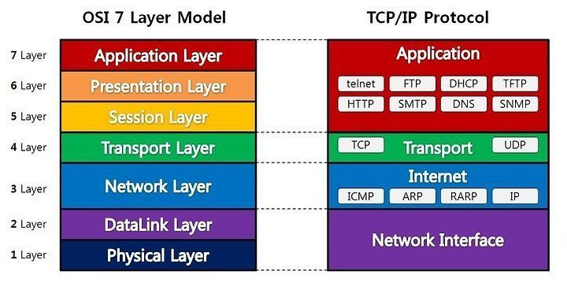
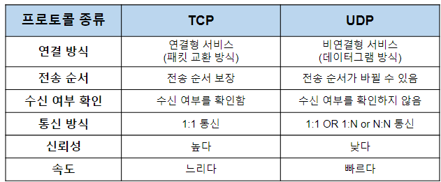
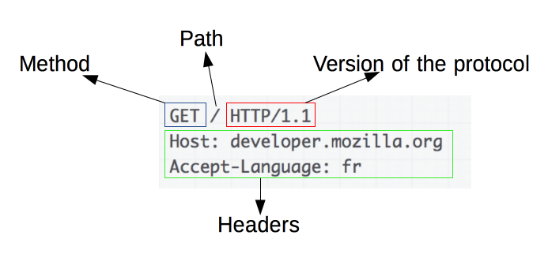
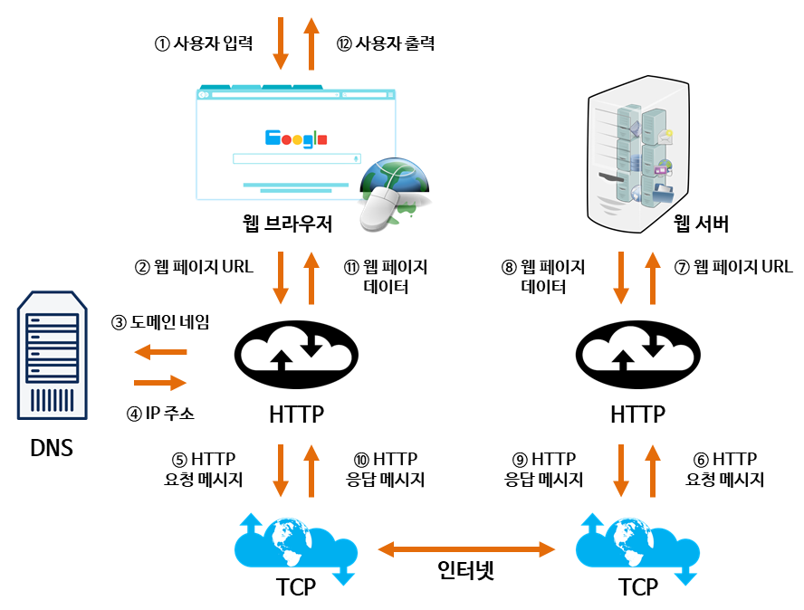

## NETWORK

    
<b>OSI 7계층과 TCP/IP 4계층</b>

## 정리

### OSI 7 계층
- 계층별로 나눔으로써 단계를 통해 통신을 파악하고 오류가 생길 경우 해당 계층만 수정하면 되는 장점이 존재한다.
#### 애플리케이션 계층 : 7계층 응용 계층
- 사용자와 직접 상호작용하는 응용 프로그램들이 포함된 계층
#### 프레젠테이션 계층 : 6계층 표현 계층
- 데이터의 형식을 정의하는 계층
#### 세션 계층 : 5계층
- 컴퓨터끼리 통신을 하기 위해 세션을 만드는 계층
#### 트랜스포트 계층 : 4계층 전송계층
- 최종 수신 프로세스로 데이터의 전송을 담당하는 계층
#### 네트워크 계층 : 3계층
- 패킷의 전송을 담당하는 계층
#### 링크 계층 : 2계층 데이터링크계층
- 데이터의 물리적인 전송과 에러 검충, 흐름 제어를 담당하는 계층
#### 물리 계층 : 1계층 
- 데이터를 전기 신호로 바꿔주는 계층
### TCP/IP
- 실제 인터넷 통신에 사용되는 실용적인 모델
## 참조
- https://mangkyu.tistory.com/91

---

    
<b>TCP/UDP</b>

## 정리

| 특징       | TCP                        | UDP                  |
|----------|----------------------------|----------------------|
| 연결 방식    | 연결형 서비스(3-way handshaking) | 비연결형 서비스             |
| 패킷 교환 방식 | 가상 회선 방식                   | 데이터그램 방식             |
| 전송 순서    | 전송 순서 보장                   | 전송 순서 보장 X           |
| 수신 여부 확인 | 수신 여부 확인                   | 수신 여부 확인 X           |
| 통신 방식    | 1:1 통신                     | 1:1 OR 1:N OR N:N 통신 |
| 신뢰성      | 높다                         | 낮다                   |
| 속도       | 느리다                        | 빠르다                  |

- 신뢰성이 중요한 파일 교환 같은 경우 TCP, 실시간성이 중요한 스트리밍에서는 UDP 사용

    
<b>3way-handshake, 4way-handshake</b>

## 정리
### 3 way-handshake
- TCP 네트워크에서 통신을 하는 장치가 서로 연결이 잘 되었는지 확인하는 방법
- 송신자와 수신자는 총 3번에 걸쳐 데이터를 주고 받으며 통신이 가능한 상태임을 확인
- 양쪽 데이터 모두 데이터를 전송할 준비가 되었다는 것을 보장하고, 실제로 데이터 전달이 시작하기 전에 한쪽이 다른 쪽이 준비됐다는 것을 알수 있다록 한다.
#### 연결 과정 (Client A, Server B)

1. A -> B: SYN
2. B -> A: SYN + ACK
3. A -> B: SYN
- TCP 헤더에 Control Bit 이 존재한다.
    - 각각의 bit 은 `URG`, `ACK`, `PSH`, `RST`, `SYN`, `FIN` 의미를 가진다.
- 2-way 로 부족한 이유는?
    - TCP 는 양방향성이기 때문에 서버에서도 클라이언트에게 존재를 알리고 패킷을 보낼 수 있다는 신호를 보내야 한다.
- 초기 Sequence Number 를 난수로 하는 이유는?
    - 커넥션을 맺을 때 사용하는 포트는 유한하기 때문에 재사용될 수 있다.
    - 서버 측에서 패킷의 SYN 을 보고 패킷을 구분하는데 순차적인 숫자라면 이전의 커넥션으로부터 오는 패킷으로 인식할 수 있다.
### 4 way-handshake
- TCP 의 연결을 해제하는 과정
#### 연결 해제 과정(Client A, Server B)
1. A -> B: Fin
2. B -> A: ACK
3. B -> A: Fin
4. A -> B: ACK
- 바로 연결 해제를 하지 않고 잠시 기다린다.
- 서버 측에서 오류 때문에 ACK 를 받지 못할 경우 재전송을 위해서
- 왜 4단계일까?
    - 클라이언트가 데이터 전송을 마쳤다고 해도 서버에서는 아직 보낼 데이터가 남아있을 수도 있기 때문에 일단 Fin 에 대한 Ack 만 보내고, 데이터를 모두 전송한 후에 자신도 Fin 메시지를 보내기 때문이다.
## 참조

    
<b>흐름제어, 혼잡제어, 오류제어</b>

## 정리
### 흐름 제어
- 송신 측과 수신 측 사이의 데이터 처리 속도 차이를 제어하기 위한 기법
- 송신 측의 데이터 처리 속도를 조절하여 수신자의 버퍼 오버플로우를 방지한다.
- 슬라이딩 윈도우 사용
### 혼잡 제어
- 네트워크 혼잡을 피하기 위해 송신측에서 보내는 데이터의 전송 속도를 제어하는 것
### 오류 제어
- 프레임이 손상되었거나 손실되었을 경우, 재전송을 통해 오류 복수
- 방법
    1. Stop-and-Wait
        - 수신 측에서 ACK 또는 NAK 을 보낸다.
        - 수신 측에서 받지 못한 경우 NAK 을 보내고 송신 측은 해당 데이터를 재전송한다.
        - 만약 분실된 경우 타임아웃을 체크하여 데이터를 재전송한다.
    2. Go-Back-N
        - 손상되거나 분실된 경우 확인된 마지막 프레임 이후로 모든 프레임 재전송
    3. Selective-Repeat
        - 손실된 프레임만 재전송
        - 별도의 재정렬을 수행
## 참조

---

    
<b>HTTP</b>

## 정리
### HTTP

- Hyper Text Transfer Protocol 의 약자로 웹 상에서 클라이언트와 서버 간에 요청/응답으로 정보를 주고 받을 수 있는 프로토콜
#### 특징
- HTTP는 애플리케이션 레벨의 프로토콜로 TCP/IP 위에서 작동
- 주로 HTML 문서를 주고 받는다. -> 평문 데이터 전송
- TCP 와 UDP 를 사용하며 80 포트를 사용한다.
    - TCP 사용 -> HTTP/1, HTTP/2
    - UDP 사용 -> HTTP/3
- 비연결 지향: 클라이언트와 서버가 요청을 주고 받으면 바로 연결이 끊긴다.
- 무상태: 연결을 끊는 순간 통신이 종료되고 상태 정보를 유지하지 않는다. 즉 상태를 가지고 있지 않은 Stateless 프로토콜이다.
## 참조

    
<b>HTTP status code</b>

## 정리
### HTTP status code
- 2xx: 요청 성공
- 3xx: redirection
- 4xx: client error
- 5xx: server error
## 참조

    
<b>HTTP METHOD</b>

## 정리
### HTTP Method

- POST: 리소스 생성 및 요청된 데이터 처리 -> 데이터 추가 및 수정
- GET: 리소스 조회
- PUT: 리소스 대체 없을 시 생성
- PATCH: 리소스 수정
- DELETE: 리소스 삭제
### 멱등성
- 메서드를 여러 번 요청해도 결과가 같은 경우
- GET, PUT, DELETE 가 해당된다.
## 참조

    
<b>HTTP 1.1 VS HTTP 2.0</b>

## 정리
#### 버전 별 특징

- HTTP/1
    - 연결 당 하나의 요청/응답을 처리하여 상당히 비효율적인 방식
    - 응답을 받아야만 다음 작업 처리
- HTTP/1.1
    - 커넥션당 하나의 요청을 처리
    - 파이프라이닝: 응답을 기다리지 않고 여러 개의 요청을 연속적으로 보낸다.
    - 커넥션 유지: Connection Keep-Alive 기능을 이용해 커넥션을 일정기간 동안 유지하는 기술이 존재한다.
    - 연관된 파일이 많을 경우 응답 속도가 느려진다.
- HTTP/2
    - 커넥션당 여러 개의 요청을 보냄(Multiplexed Streams) -> 하나의 커넥션으로 여러 개의 메세지를 순서 상관없이 동시에 주고 받을 수 있음
    - 리소스간의 의존관계를 확인해 우선순위를 판별해 응답한다.
    - Server Push: 서버는 클라이언트 요청에 대해 요청하지 않은 리소스도 보낼 수 있다.
## 참조

    
<b>HTTP와 HTTPS</b>

## 정리
### HTTP
- 평문 데이터를 전송하는 프로토콜 -> 비밀번호/주민번호 등 보안 관련 데이터는 전송하면 안됨
- 이러한  문제를 해결하기 위해 HTTP에 암호화가 추가된 프로토콜인 HTTPS 등장

### HTTPS
- HyperText Transfer Protocol over Secure Socket Layer
- HTTP 의 보안이 강화된 버전의 프로토콜
#### 특징
- 443 포트 사용
- SSL, TLS(SSL 최신 버전)을 이용해 암호화
- 전송 계층과 응용 계층 사이에서 암호화된다.
- body 부분만 암호화한다.
- 장점
    - 네트워크 상에서 열람, 수정이 불가능하므로 안전하다.
- 단점
    - 암호화하는 추가 비용이 발생한다.
    - 인터넷 연결이 끊긴 경우 재인증 시간이 소요된다.
#### HTTPS 원리
- 공개키 + 대칭키 혼합 방식
1. A 에서 B 로 접속 요청
2. B 에서 A 로 공개키 전달
3. A 는 자신의 대칭키를 공개키로 암호화해서 B에게 전달
4. B 는 개인키로 복호화하여 A 의 대칭키를 얻음
5. 얻은 대칭키를 통해 암복호화
## 참조

    
<b>TCP와 HTTP 차이</b>

## 정리
### TCP
- 연결형 서비스
- 3-way handshaking 과정을 통해 연결 설정
- 양방향 통신 가능
- 전송 계층(4) 프로토콜

### HTTP
- 비연결형 서비스
- 단방향 통신만 가능
- 응용 계층(7) 프로토콜

---

    
<b>REST API</b>

## 정리
### REST 란?
- Representational State Transfer 의 약자로 자원을 기반으로 설계하는 개발 아키텍처이다.
- URI 에 `자원`을 명시하고 `메서드`를 통해 자원에 대한 행동을 지정하며, 이에 대한 응답으로 자원의 `형태`를 지정할 수 있다.
### 구성요소
- Resource
    - 서버는 식별 가능한 ID 를 가지는 자원을 가지고 있다.
    - 클라이언트는 식별 가능한 ID 로 자원에 대한 요청을 보낼 수 있다.
    - 이는 URI 에 해당한다.
- Method
    - 서버에 요청을 보내기 위한 방식이다.
    - GET, POST, PUT, PATCH, DELETE 가 있다.
- Representation
    - 클라이언트와 서버가 데이터를 주고받는 형태를 의미한다.
    - JSON, XML, TEXT, RSS 등이 있다.
### 특징
- Uniform interface
    - 자원에 대한 요청 방식이 통일되고 일관된 형태를 의미한다.
    - 클라이언트의 플랫폼, 언어, 기술과 관계없이 일정한 형태를 가진다.
    - HTTP 를 사용하는 모든 플랫폼에서 사용가능하게 한다.
- Stateless
    - 각각의 요청을 별개의 것으로 인식하고 처리해야 한다.
    - 작업을 위한 상태정보를 저장 및 관리하지 않는다.
    - 서비스의 자유도가 높아지고, 서비스에서 불필요한 정보를 관리하지 않아 구현이 단순해진다.
- Cacheable
    - HTTP 프로토콜 표준에서 사용되는 Last-Modified Tag 또는 E-Tag 를 이용하여 캐싱을 구현할 수 있다.
- Client-Server Architecture
    - 서버는 API 를 제공하며, 클라이언트는 사용자 인증, Context 등을 직접 관리하는 등 역할을 확실히 구분하여 서로의 의존성을 줄인다.
- Self-Descriptiveness
    - Rest API 는 요청 메시지만 보고도 이를 쉽게 이해하도록 자체 표현 구조로 되어 있다.
- Layered System
    - Rest API 의 서버는 다중 계층으로 구성될 수 있다.
### 규칙
- URI 는 명사를 사용한다.
- 슬래시를 통해 계층 관계를 표현한다.
- URI 의 마지막에는 슬래시를 붙이지 않는다.
- URI 는 소문자로만 구성한다.
- 가독성을 위해 하이픈을 사용할 수 있다.
### 장단점
- 장점
    - HTTP 표준을 활용할 수 있다.
- 단점
    - 구현 브라우저에는 호환되지 않는 경우가 있다.
## 참조
- https://mangkyu.tistory.com/46

---

    
<b>COOKIE & SESSION</b>

## 정리
### 쿠키와 세션의 필요성
- HTTP 의 Stateless 와 Connectionless 특징으로 각 요청 간 의존관계가 없다.
- 이 때문에 클라이언트는 요청마다 인증이 필요할 수 있다.
- 이를 방지하기 위해 쿠키와 세션으로 인증을 구현한다.
### COOKIE
- 웹 브라우저에 보관하는 데이터
- key-value 형태로 저장
#### 동작 방식
1. 웹 브라우저가 서버에 요청
2. 상태를 유지하고 싶은 값을 쿠키로 생성
3. HTTP 헤더에 담아 클라이언트에 응답
4. 이후 클라이언트는 헤더에 쿠키 값을 포함하여 요청
#### 쿠키 인증의 문제점
- 값을 그대로 내보이기 때문에 보안에 취약하다.
- 많은 양의 데이터를 담지 못한다.
### SESSION
- 서버에 저장되는 클라이언트의 상태 데이터
- 서버에서는 클라이언트를 구분하기 위해 고유 ID 를 할당한다.
#### 동작 방식
1. 클라이언트가 서버에 요청
2. 서버가 클라이언트에 ID 부여
3. 서버가 쿠키에 ID 를 포함해서 전송
4. 클라이언트는 웹브라우저를 닫기까지 요청에 ID 가 담겨있는 쿠기를 헤더에 넣어 전송
#### 쿠키에 비해 좋은 점
- 세션은 비교적 보완성이 좋다.
- 서버 사양에 따라 용량이 충분하다.
#### 세션 방식 문제점
- 사용자가 늘어날 수록 부하가 커짐
- 확장하기 힘듬. 서버를 확장하기 위한 비용이 크거나 세션 저장소를 분산시킬 경우 처리가 번거롭다.
## 참조
- https://mangkyu.tistory.com/55
- https://steady-coding.tistory.com/506
- https://velog.io/@jsj3282/%EC%BF%A0%ED%82%A4%EC%99%80-%EC%84%B8%EC%85%98%EC%9D%98-%EC%9E%A5%EB%8B%A8%EC%A0%90

---

    
<b>JWT</b>

## 정리
### JWT
- Json Web Token 으로, Json 포맷을 이용하여 사용자에 대한 속성을 저장하는 Claim 기반의 Web Token 이다.
> Claim 이란 Json 에 있는 속성을 의미한다. 인증의 경우에는 비밀번호나 아이디라고 볼 수 있다.
### 구조
- Header, Payload, Signature 로 구성된다.
- 각 부분은 Json 형태로 되어 있으며, Base64 URL 로 인코딩되어 있다.
> Base64 URL: 이진 데이터를 문자 코드에 영향을 받지 않는 ASCII 영역의 문자들로 바꾸는 인코딩 방식으로 특히 URL 에 사용될 수 있는 `+`, `/` 값들을 `-`, `_` 로 바꾸어 웹으로 전송할 때 안전하다.
- 각 부분은 `.`으로 구분된다.
- Header: 토큰의 타입을 지정하고, Signature 를 해싱하기 위한 알고리즘 방식을 지정한다.
- Payload: 토큰에서 사용할 정보의 조각들인 클레임이 담겨있다.
- Signature: 토큰을 인코딩하거나 유효성 검증을 할 때 사용하는 암호화 코드이다.
### 토큰 기반 인증은 왜 필요할까?
- 기존 세션 방식으로는 사용자가 늘어날 수록 서버의 부담이 커진다.
- 토큰을 통해 인증할 경우 상태를 유지하지 않으므로 확장성에 부담이 적어진다.
### 장단점
- 장점
    - 서버 확장이 용이하다.
    - 쿠키로 전달하지 않으므로 보안이 우수하다.
    - 선택적인 퀀한 허용이 가능하다.
- 단점
    - 토큰 자체에 정보를 담고 있으므로 이 때문에 보안이 취약해질 수 있다. 이를 위해 유효 시간을 짧게 가져야 한다.
    - 토큰이 한번 만들어지면 임의로 삭제나 제어가 불가능하다.
### Refresh Token
#### 왜 사용할까?
- 토큰 자체가 탈취될 경우 안에 담긴 정보를 볼 수 있다.
- 이를 방지하기 위해 유효시간을 짧게 가져간다.
- 하지만, 유효시간을 짧게 할 경우 인증을 자주 해야하는 단점이 생겼다.
- 이를 방지하기 위해 Refresh Token 이 사용되었다.
#### 개념
- 기존 토큰을 Access Token 이라고 하고, 이는 유효 시간을 굉장히 짧게 가져간다. 또한 사용자 확인의 용도로 사용된다.
- 반면 Refresh Token 은 유효 시간을 길게 가져가고, 재발급을 위한 용도로 사용된다.
#### 재발급 과정
1. 로그인 시 Access Token 과 Refresh Token 모두 발급한다.
    - 서버에는 Refresh Token 만 저장하고, 클라이언트에 Access Token 과 Refresh Token 을 보낸다.
2. 사용자 인증이 필요한 경우 토큰을 검사한다.
    1. Access Token 과 Refresh Token 모두 만료된 경우
        - 재로그인
    2. Access Token 은 유효, Refresh Token 은 만료된 경우
        - Access Token 을 검증하여 Refresh Token 재발급
    3. Access Token 은 만료, Refresh Token 은 유효한 경우
        - Refresh Token 을 검증하여 Access Token 재발급
    4. Access Token 과 Refresh Token 모두 유효한 경우
        - 정상 처리
3. 로그아웃 시 Access Token 과 Refresh Token 을 모두 만료시킨다.
## 참조
- https://mangkyu.tistory.com/55
- https://inpa.tistory.com/entry/WEB-%F0%9F%93%9A-Access-Token-Refresh-Token-%EC%9B%90%EB%A6%AC-feat-JWT

---

    
<b>CORS</b>

## 정리
### CORS
- 도메인이 다른 사이트가 자원에 대해 접근할 수 있는 권한을 부여하는 체제이다.
### 출처란
- Protocol + Host + Port 를 출처라 한다.
- https://www.google.com:443
### 동작 방식
#### 단순 요청
- GET, HEAD, POST 요청만 가능
- Accept, Accept-Language, Content-Language 헤더만 변경
- Content-Type 이 application/x-www-form-urlencoded, multipart/form-data, text/plain 이 중 하나인 것
- 통신 과정
1. 서버로 요청
2. 서버의 응답으로 온 Access-Control-Request-Headers 값과 브라우저가 요청한 Origin 을 비교하여 유효한 요청이면 리소스 응답
    - 만약 유효하지 않다면 브라우저가 이를 막고 에러를 발생시킨다.
#### preflight 요청
- 요청 헤더 목록
    - Origin
    - Access-Control-Request-Method
        - 실제 요청에서 어떤 메서드를 사용할 것인지
    - Access-Control-Request-Headers
        - 실제 요청에서 어떤 header 를 사용할 것인지
- 응답 헤더 목록
- Access-Control-Allow-Origin
    - 브라우저가 해당 origin 이 자원에 접근할 수 있도록 허용
    - `*` 은 모든 origin 허용
- Access-Control-Expose-Headers
    - 브라우저가 액세스할 수 있는 서버 화이트리스트 헤더를 허용
- Access-Control-Max-Age
    - 얼마나 오랫동안 preflight 요청이 캐싱 될 수 있는지
- Access-Control-Allow-Credentials
    - 요청에 대한 응답이 노출될 수 있는지
    - preflight 요청에 대한 응답의 일부로 사용되는 경우 실제 자격 증명을 사용하여 실제 요청을 수행할 수 있는지 확인
- Access-Control-Allow-Methods
    - preflight 요청에 대한 대한 응답으로 허용되는 메서드들
- Access-Control-Allow-Headers
    - preflight 요청에 대한 대한 응답으로 실제 요청 시 사용할 수 있는 HTTP 헤더를 나타냄
- 통신 과정
1. Origin 헤더에 현재 요청하는 origin 과 Access-Control-Request-Method 헤더에 요청하는 HTTP 메서드, Access-Control-Request-Headers 요청 시 사용할 헤더를 담아 OPTIONS 메서드로 서버에 요청
2. 브라우저는 서버의 응답을 받아 헤더를 살펴보고 유효한 요청인지 확인
    - 만약 유효하지 않다면 요청은 중단되고 에러 발생
    - 만약 유효하다면 원래 보내려던 요청 전송
### SOP
- Same-Origin policy
- 다른 출처에 의한 자원 접근을 막는 정책
## 참조

---

    
<b>DNS</b>

## 정리
### DNS
- IP 주소를 도메인 이름으로 바꿔주는 서버 또는 시스템
- 512 bytes 가 넘어가지 않는 패킷만 전송 가능
- DNS 는 계층적으로 관리한다.
### DNS 종류
- 권한이 없는 네임 서버
    - Recursive DNS
        - IP 주소를 캐싱해놓는 서버
        - ISP, 구글 DNS 등등
- 권한이 있는 네임 서버
    - Root DNS
        - ICANN 이 직접 관리하는 서버로, TLD DNS 서버의 IP 주소들을 저장해두고 안내하는 역할 수행
    - TLD DNS
        - 도메인 등록 기관이 관리하는 서버, Authoritative DNS 를 안내하는 역할 수행
    - Authoritative DNS
        - 실제 개인 도메인의 IP 주소가 관리되는 서버
#### UDP 를 사용하는 이유가 뭘까?
- 빠른 속도
    - 연결 설정 비용이 없기 때문에
- 패킷 사이즈가 작기 때문에 패킷 유실이 적다.
- 연결 상태를 유지할 필요가 없다.
### 질의 메시지
- Query Name String
    - 요청하고자 하는 도메인 이름
    - www.naver.com
- Type
    - 질의의 데이터 타입
    - 응답 정보의 내용이 달라진다.
    - A
- Class
    - 질의의 클래스
    - IN (현재는 인터넷만 사용)
### 동작 과정
1. 브라우저에 도메인 네임을 입력하면, ISP (Recursive DNS)에서 도메인 주소에 해당하는 IP 주로를 요청한다.
2. 만약 캐시 데이터가 있으면 바로 반환하고 아니면 Root DNS 에게 어디로 가야하는지 요청한다.
3. Root DNS 는 TLD DNS 주소로 안내한다.
4. ISP 는 TLD DNS 에게 어디로 가야하는지 요청한다.
5. TLD DNS 는 Authorize DNS 주소로 안내한다.
6. ISP 는 Authorize DNS 의 주소를 캐시로 기억하고 이를 브라우저에게 안내한다.
## 참조

---

    
<b>Blocking/Nonblocking&Synchronous/Asynchronous</b>

## 정리
### Blocking/Nonblocking
- 다른 주체가 작업할 때 자신의 제어권이 있는지 없는지 구분
#### Blocking
- 함수를 호출하면 제어권을 넘기는 방식
- 호출된 함수가 종료될 때까지 작업을 기다린다.
#### Nonblocking
- 호출된 함수의 작업이 끝나지 않아도 제어권을 건내주는 방식
- 호출된 함수가 종료될 때까지 기다리지 않고 작업을 진행한다.
### Synchronous/Asynchronous
- 호출된 함수의 작업 완료를 따져 작업을 시작하는지 구분
#### Synchronous
- 호출된 함수의 작업이 완료되면 호출한 함수 마저 실행
#### Asynchronous
- 호출된 함수의 작업이 완료되지 않더라도 호출한 함수 마저 실행
- 작업 완료를 기다리지 않는다.
## 참조
- https://steady-coding.tistory.com/531

---

    
<b>웹 통신의 흐름(www.example.com을 입력했을 때)</b>

## 정리

1. 사용자가 브라우저에 URL 입력
2. 브라우저는 URL 에 대응하는 IP 를 캐시에서 확인한다.
3. 없으면 라우터, ISP 캐시를 확인하고 모두 없으면 DNS 를 통해 IP 주소를 찾는다.
4. TCP/IP 연결 -> 3 way handshaking
5. HTTP 요청 전송 -> 서버로 전송
6. 서버는 HTTP 프로토콜을 활용해 HTTP 응답 메시지 생성
7. 브라우저는 서버로부터 받은 응답 메시지를 출력하여 사용자가 볼 수 있도록 한다.

---

    
<b>공인 IP와 사설 IP 차이</b>

## 정리
- 공인 IP
  - 전세계에서 유일한 Ip로 ISP(인터넷 서비스 공급자)가 제공하는 IP주소
  - 외부에 공개되어 있기 때문에 인터넷에 연결된 다른 장비로부터 접근이 가능하다.
  - 그에 따라 방화벽 등과 같은 보안 설정 필수
- 사설 IP
  - 어떤 네트워크 안에서 사용되는 IP주소
  - IPV4의 부족으로 인해 모든 네트워크가 공인 IP를 사용하는 것이 불가능하기 때문에 네트워크 안에서 라우터를 통해 할당받는 가상의 주소이다.
  - 별도의 설정없이는 외부에서 접근 불가

