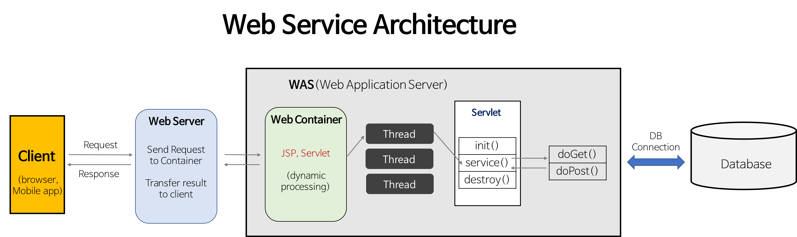

## 미들웨어 정의

### 1. 사전적 정의
  - 양 쪽을 연결하여 데이터를 주고 받을 수 있도록 중간에서 매개 역할을 하는 소프트웨어
  - 네트워크를 통해서 연결된 여러 개의 컴퓨터에 있는 많은 프로세스들에게 어떤 서비스를 사용할 수 있도록 연결해 주는 소프트웨어를 말한다. 
  - 3계층 클라이언트/서버 구조에서 미들웨어가 존재한다. 
  - 웹 브라우저에서 데이터베이스로부터 데이터를 저장하거나 읽어올 수 있게 중간에 미들웨어가 존재하게 된다.

#### 핵심 요약
  - 양쪽을 연결
  - 중간에서의 매개 역할
  - 서로 다른 시스템을 하나로 묶는 소프트웨어 접착제

### 2. 매개체
  - 클라이언트(사용자) <-> 서버, 서버 <-> 서버 간의 통신
  - 통상적으로 기업에서 말하는 미들웨어 환경은 웹/ 어플리케이션 서버

### 3. 나오게 된 배경
- 기존 웹 어플리케이션 운영 환경에서는 운영자가 하나의 서버만 죽자고 운영하면 되서 관리 포인트가 1개라는 장점이 있었다.
- 만약, 그 1개의 통합 서버에 문제가 생겼을 때 전체 서비스 장애로 이어지고 분석도 쉽지 않다.
- 이런 경우를 1-Tire 구조라고 한다.

#### 해결 방법
- 사용자의 요청이 유입되는 순간 호출되는 앞단(Front-end)의 정적 페이지(html, css, js, png 등)를 전용으로 처리하는 서버 => Web server
- 로그인, 검색 등 데이터를 가공하고 처리하는 뒷단(Back-end)의 동적 페이지(jsp, servlet 등)를 전용으로 처리하는 서버 => Was
- 이렇게 통합 서비스 1개와 위의 2개의 분리된 관리 포인트로 쪼개진 것을 3-Tier 구조라고 한다.

### 4. 미들웨어 담당자

- 미들웨어 담당자는 위 그림에서의 Client - Database 사이에 위치한 WEB Server - WAS를 관리한다.

### 5. 미들웨어 종류
1. 웹 서버 미들웨어
   - Apache Tomcat, NginX
   - 웹 어플리케이션과 서버 간의 통신을 지원
2. 메시징 미들웨어
   - Apache Kafka, RabbitMQ
   - 분산된 시스템 간의 메시지 전달을 중개
3. 데이터베이스 미들웨어
   - Hibernate
   - 애플리케이션과 데이터베이스 간의 데이터를 매핑하고 처리

### 6. 미들웨어 설계
