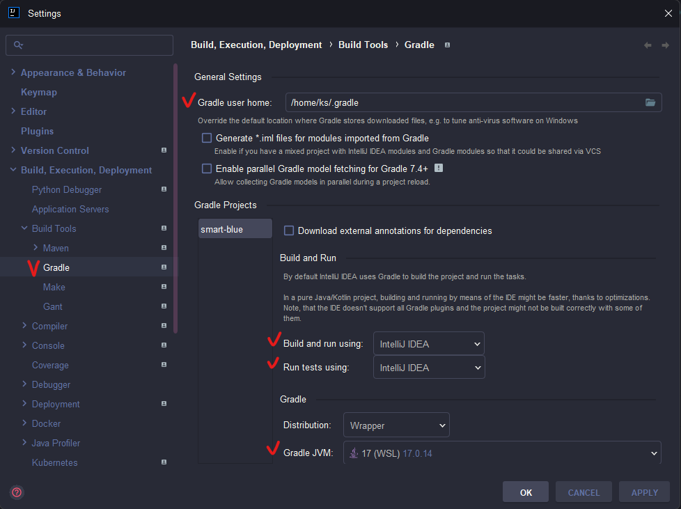

### 오류 내용
```
Cannot invoke "java.io.File.getPath()" because the return value of "org.gradle.tooling.internal.consumer.parameters.ConsumerOperationParameters.getJavaHome()" is null
```

### 오류 해결
  - wsl 환경에서 올바른 gradle 경로 지정
  - Setting 설정 -> 사진 참고
  - 해당 프로젝트의 숨겨진 파일의 .gradle 경로로 설정
  - 빨간색 표시한 부분들 수정하기
  
 
### 만약 그래로 안된다면..    
1. 먼저 JDK 위치 확인 </br>
  ``` sudo update-alternatives --config java ```
  ```
  ks@kspark  ~/work/smart-blue  sudo update-alternatives --config java

  [sudo] password for ks: 
  There are 2 choices for the alternative java (providing /usr/bin/java).

  Selection    Path                                         Priority   Status
  ------------------------------------------------------------
    0            /usr/lib/jvm/java-21-openjdk-amd64/bin/java   2111      auto mode
  * 1            /usr/lib/jvm/java-17-openjdk-amd64/bin/java   1711      manual mode
    2            /usr/lib/jvm/java-21-openjdk-amd64/bin/java   2111      manual mode

  Press <enter> to keep the current choice[*], or type selection number:
  ```

2. 사용 중인 쉘에 맞게 환경 변수 설정 </br>
``` vim ~/.bashrc  ```
3. 해당 파일 끝에 다음 내용을 추가 -> 내용이 있다면 넘어가기
```
    export JAVA_HOME=/usr/lib/jvm/java-17-openjdk-amd64
    export PATH=$JAVA_HOME/bin:$PATH
```
4. 적용
``` source ~/.bashrc  ```
5. 그레들 권한 변경 후 다시 시작
``` java
 chmod +x ./gradlew // 권한 변경
./gradlew clean build
./gradlew build -x test // test 파일은 제오이
```
