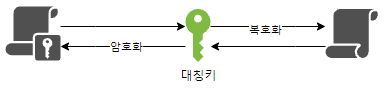
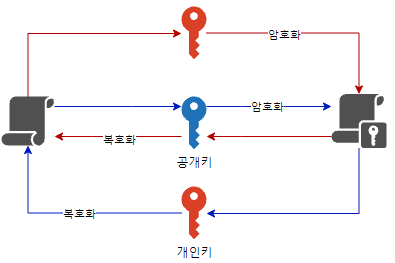

## CSRF & XSS

## 블록체인

    
<b>암호화 기술 (feat.대칭키와 비대칭키) </b>

## 정리
### 대칭키

- 암호화, 복호화에 사용되는 키가 동일
#### 장점
- 구현이 용이하고 데이터를 암호화하기 위한 연산이 빨라 대용량 데이터 암호화에4 적합

#### 단점
- 강한 보안을 위해 키를 주기적으로 교환해줘야 한다.
- 키 탈취 및 관리가 어렵다.

#### 종류
- 블록 암호 방식
  - 기밀성이 있는 정보를 정해진 블록 단위로 암호화하는 대칭키 암호 시스템으로 만약 암호화하려는 정보가 블록 길이보다 길 경우 특정한 운용 모드가 사용
  - SEED. AES, DES 등

---

### 비대칭키 = 공개키

- 암호화, 복호화에 사용하는 키가 서로 다르다.
- 외부에 절대 노출되어서는 안되는 `개인키`와 공개적으로 개방되어 있는 `공개키`가 쌍으로 이루어진 형태이다.

#### 장점
- 키 분배 및 키 관리가 용이

#### 단점
- 연산 속도가 느리다.
- 상대적으로 키 길이가 길다.

#### 종류
- RSA 등 

### 대칭키와 비대칭키의 혼합
- A가 B의 공개키로 암호화 통신에 사용할 대칭키를 암호화하고 B에게 보냄
- B가 암호문을 받고 자신의 비밀키로 복호화함
- B는 A로부터 얻은 대칭키로 A에게 보낼 평문을 암호화하여 A에게 보냄
- A는 자신의 대칭키로 암호문을 복호화함
- 앞으로 이 대칭키로 암호화를 통신함
- 대량의 자료를 통해 암복호화 실행

